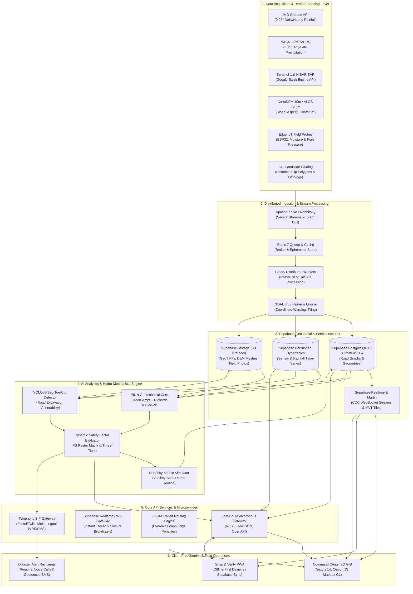
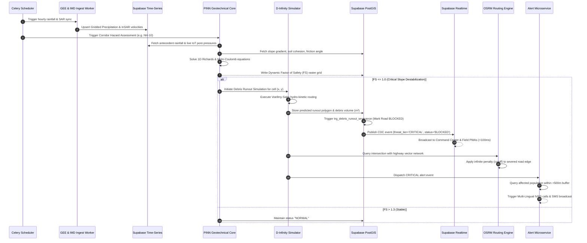
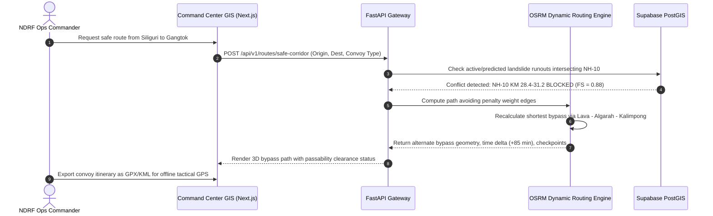
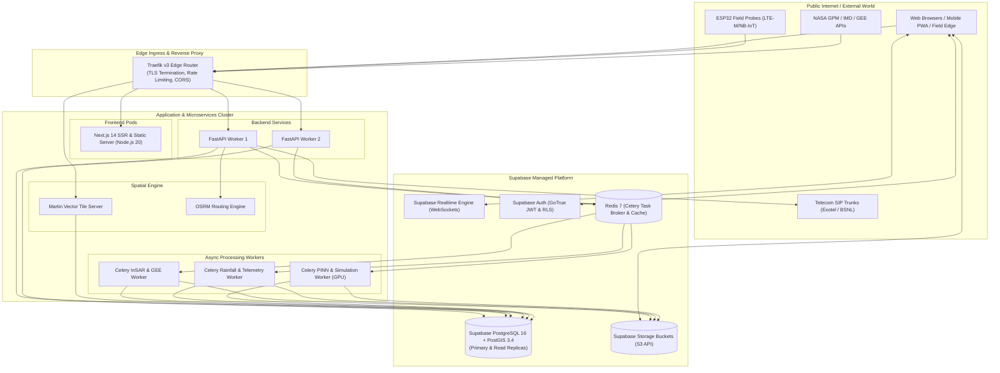

# TerraCast-NER: System Architecture & Technical Specifications
**Ministry of Development of North Eastern Region (MDoNER) | Problem Statement ID: 26001**

---

## 1. System Overview

**TerraCast-NER** is an enterprise-grade, all-weather landslide early warning and dynamic disaster response system engineered specifically for the North Eastern Region (NER) of India. The platform integrates heterogeneous earth-observation feeds, deep physical mechanics via Physics-Informed Neural Networks (PINNs), edge IoT ground telemetry, and dynamic transit graph algorithms into a unified, high-availability architecture.

### Key Architectural Tenets
1. **Zero-Monsoon Blindness**: Decoupling early warning from optical satellite availability by ingesting cloud-penetrating Sentinel-1 (C-Band) and NISAR (L/S-Band) Synthetic Aperture Radar (SAR).
2. **Physics-Constrained Inference**: Bounding deep learning predictions within the laws of continuum mechanics (Richards equation, Green-Ampt infiltration, Mohr-Coulomb failure criteria) to prevent false-positive alert fatigue.
3. **End-to-End Resilience**: Dual offline-first edge architecture:
   - Low-cost PWA client using IndexedDB and Service Worker background synchronization.
   - Low-bandwidth Vector Tile (MVT) streaming for high-density 3D GIS visualization in remote command centers.
4. **Actionable Evacuation & Convoy Routing**: Moving beyond static heatmaps to compute 3D kinetic debris runouts, pinpointing the exact minute of highway severance and recalculating real-time bypass routes for disaster convoys (NDRF/SDRF/BRO).

---

## 2. End-to-End Architectural Blueprint

---

## 3. Detailed Data Flow & Execution Sequences

### 3.1 Real-Time Hazard Evaluation & Dynamic $FS$ Workflow

---

### 3.2 Dynamic Convoy Rerouting (NDRF/SDRF Logistics)

---

## 4. Subsystem Breakdown

### 4.1 Ingestion & Preprocessing Subsystem
* **Rainfall Processor**: Ingests IMD gridded daily/hourly APIs and NASA GPM IMERG Early/Late runs. Computes the Antecedent Precipitation Index ($API_{15}$) over a 15-day sliding decay window ($k=0.85$).
* **SAR InSAR Interferometry Processor**: Interfaces with Google Earth Engine (GEE) Python API. Ingests Sentinel-1 Single Look Complex (SLC) and Ground Range Detected (GRD) interferograms to track millimeter-scale ground creep along highway slopes.
* **IoT Telemetry Broker**: Encrypted MQTT/HTTPS endpoints receiving telemetry from ESP32 edge probes (soil moisture volumetric water content $\theta_{30}, \theta_{60}, \theta_{120}$ and pore-water pressure $u_w$).

### 4.2 Analytical & Modeling Subsystem
* **PINN Geotechnical Core**: A DeepXDE/PyTorch neural network that evaluates slope stability by enforcing 1D Green-Ampt infiltration and Richards equations within its loss function, determining dynamic Factor of Safety ($FS$) without the false alarms of empirical thresholding.
* **Anthropogenic Toe-Cut Detector**: Computer vision engine (YOLOv8-Seg) trained on aerial/satellite imagery and digital elevation curvature to flag destabilized slopes caused by unreinforced road cutting and highway widening.
* **D-Infinity Kinetic Runout Simulator**: Hydrodynamic mass-movement solver that simulates downslope debris propagation, flow velocity, deposit thickness, and road cutoff impact timestamps.

### 4.3 Storage, Realtime & Geospatial Engine (Supabase)
* **Supabase PostgreSQL 16 + PostGIS 3.4**: Houses the road network topology, administrative boundaries, GSI historical landslide polygons, and live threat zones indexed using `GIST` spatial indices.
* **Supabase Realtime (CDC)**: Direct WebSocket subscriptions for frontend clients, eliminating polling overhead for critical landslide elevations and road cutoff alerts.
* **Supabase Storage**: Managed S3-compatible asset store with automatic optimization for high-resolution field photos, drone footage, and InSAR GeoTIFF rasters.
* **Martin Vector Tile Server**: Converts PostGIS geometries into Mapbox Vector Tiles (`.mvt`) on the fly, enabling low-bandwidth 60fps rendering in the browser.

### 4.4 Communication & Dissemination Subsystem
* **Telephony SIP Trunking & IVRS**: Automated outbound voice calling through Exotel/Twilio SIP trunks, executing regional neural text-to-speech in **Khasi, Mizo, Assamese, Bodo, Garo, Nepali, and Hindi**.
* **SMS Gateway**: Prioritized transactional SMS broadcasts dispatched to geofenced mobile numbers registered within the threat perimeter.

---

## 5. Deployment Topology & Infrastructure

---

## 6. Security, Reliability & Governance

### 6.1 Authentication & Access Control (RBAC)
* **JWT-Based Authentication**: Secure stateless token issuance with role-based access control (`SUPER_ADMIN`, `COMMAND_OFFICER`, `FIELD_REPORTER`, `PUBLIC_OBSERVER`).
* **Hardware API Keys**: IoT telemetry submissions authenticated via HMAC-SHA256 device signatures cross-verified against a hardware security module (HSM) device registry.

### 6.2 Data Integrity & Anti-Spoofing
* **Field Report Attestation**: Citizen/officer submissions via "Snap & Verify" must provide genuine EXIF metadata, GPS accuracy $< 15\text{m}$, and device compass/gyroscope slope azimuth matching the underlying CartoDEM aspect within $\pm 25^\circ$.

### 6.3 Disaster Recovery & High Availability
* **Database Replication**: Multi-AZ PostgreSQL physical streaming replication with automated failover via Patroni.
* **Low-Bandwidth Fallback**: When bandwidth drops below 128 kbps (common in mountain valleys), the frontend automatically drops 3D terrain meshes, falling back to 2D vector tiles and lightweight cached alerts.
