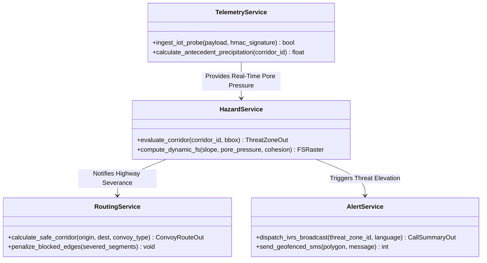
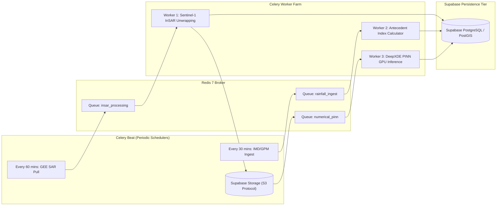

# TerraCast-NER: Backend Microservices & AI Pipeline Engine
**Ministry of Development of North Eastern Region (MDoNER) | Problem Statement ID: 26001**

---

## 1. Overview & Architecture Philosophy

The **TerraCast-NER** backend is an asynchronous, distributed microservice architecture built for compute-intensive spatial modeling, real-time edge telemetry ingestion, and low-latency emergency routing.

### Core Architectural Capabilities
* **High-Throughput Asynchronous Gateway**: Powered by **FastAPI** on an ASGI server (Uvicorn) handling concurrent IoT telemetry streams and GIS queries.
* **Decoupled Task Processing**: **Celery** workers coordinated by **Redis 7** managing long-running satellite InSAR processing, rainfall raster clipping, and 3D hydrodynamic simulations.
* **Physics-Ground AI Serving**: PyTorch / DeepXDE microservice executing the 1D Green-Ampt & Richards equation PINN solver alongside ONNX Runtime for YOLOv8 cut-slope computer vision inference.
* **Dynamic Transit Graph Modeler**: Integrates with an internal **OSRM** instance, updating graph edge costs in real time as debris runouts intersect highways.

---

## 2. Directory Structure

```text
backend/
├── app/
│   ├── api/                    # API Route definitions
│   │   ├── v1/
│   │   │   ├── endpoints/
│   │   │   │   ├── auth.py            # JWT token issuance, RBAC verification
│   │   │   │   ├── hazard.py          # /api/v1/hazard/evaluate & corridor status
│   │   │   │   ├── routes.py          # /api/v1/routes/safe-corridor (OSRM bypass)
│   │   │   │   ├── telemetry.py       # /api/v1/telemetry/iot-ingest (ESP32 HMAC)
│   │   │   │   ├── field_reports.py   # /api/v1/field-reports/submit (PWA sync)
│   │   │   │   └── alerts.py          # /api/v1/alerts/broadcast (IVRS/SMS dispatch)
│   │   │   └── router.py              # Aggregated v1 API router
│   ├── core/                   # Infrastructure configuration & security
│   │   ├── config.py                  # Pydantic BaseSettings (Env variables)
│   │   ├── database.py                # Async SQLAlchemy 2.0 & asyncpg engine
│   │   ├── redis.py                   # Redis connection pools & pub/sub client
│   │   └── security.py                # Password hashing, JWT token decode, HMAC verify
│   ├── models/                 # SQLAlchemy 2.0 ORM models
│   │   ├── telemetry.py               # IoT sensor hypertables & rainfall records
│   │   ├── hazard.py                  # Landslide threat zones & runout geometries
│   │   ├── road_network.py            # Highway corridors & road segment edges
│   │   └── field_report.py            # Citizen/officer reports with PostGIS points
│   ├── schemas/                # Pydantic v2 Request/Response validation schemas
│   │   ├── hazard.py                  # HazardEvaluationRequest, ThreatZoneOut
│   │   ├── route.py                   # SafeCorridorRequest, ConvoyRouteOut
│   │   ├── telemetry.py               # ESP32TelemetryIn, RainfallRecordIn
│   │   └── alert.py                   # IVRSBroadcastRequest, SMSPayloadOut
│   ├── services/               # Business logic & domain engines
│   │   ├── osrm_service.py            # Dynamic OSRM graph edge weight updater
│   │   ├── ivrs_service.py            # Exotel/Twilio SIP trunking & regional TTS
│   │   ├── spatial_service.py         # PostGIS spatial queries (ST_Intersects, ST_Buffer)
│   │   └── anti_spoofing.py           # EXIF integrity & gyroscope aspect validation
│   ├── tasks/                  # Celery worker background tasks
│   │   ├── celery_app.py              # Celery broker & result backend config
│   │   ├── insar_tasks.py             # GEE API Sentinel-1 / NISAR LOS velocity sync
│   │   ├── rainfall_tasks.py          # IMD & NASA GPM IMERG ingestion & API15 calc
│   │   └── simulation_tasks.py        # D-Infinity Voellmy-Salm runout worker
│   └── ml/                     # AI/ML & Numerical simulation engines
│       ├── pinn/
│       │   ├── model.py               # DeepXDE / PyTorch PINN architecture
│       │   ├── physics_loss.py        # Green-Ampt & 1D Richards PDE residuals
│       │   └── inference.py           # Dynamic FS raster matrix generation
│       ├── cut_slope/
│       │   ├── yolo_onnx.py           # YOLOv8-Seg ONNX runtime toe-cut inference
│       │   └── weights/               # Fine-tuned model checkpoints
│       └── runout/
│           ├── dinfinity.py           # D-Infinity hydraulic flow routing algorithm
│           └── voellmy.py             # Voellmy-Salm frictional resistance solver
├── tests/                      # Unit & integration test suites (pytest-asyncio)
├── Dockerfile                  # Multi-stage production container
├── pyproject.toml              # Poetry dependencies & lockfile
└── docker-compose.yml          # Local orchestration (FastAPI, Redis, PostGIS, OSRM)
```

---

## 3. Asynchronous Microservices & REST API Contracts



### 3.1 Endpoint 1: Hazard Evaluation (`POST /api/v1/hazard/evaluate`)

```python
# app/schemas/hazard.py
from pydantic import BaseModel, Field
from typing import List, Optional
from datetime import datetime
from uuid import UUID

class BoundingBox(BaseModel):
    min_lat: float = Field(..., ge=20.0, le=30.0)
    max_lat: float = Field(..., ge=20.0, le=30.0)
    min_lon: float = Field(..., ge=85.0, le=98.0)
    max_lon: float = Field(..., ge=85.0, le=98.0)

class HazardEvaluationRequest(BaseModel):
    corridor_id: str = Field(..., example="NH-10")
    bounding_box: BoundingBox
    rainfall_forecast_hours: int = Field(default=24, ge=1, le=72)
    include_runout_simulation: bool = Field(default=True)

class RunoutMetrics(BaseModel):
    time_to_road_cutoff_mins: int
    debris_volume_cubic_meters: float
    debris_deposition_depth_meters: float

class CriticalZoneOut(BaseModel):
    zone_id: UUID
    location_name: str
    chainage_km: float
    factor_of_safety: float
    threat_tier: str
    trigger_probability: float
    pore_water_pressure_kpa: float
    estimated_slip_depth_meters: float
    runout_metrics: Optional[RunoutMetrics] = None
    affected_road_geojson: dict

class HazardEvaluationResponse(BaseModel):
    status: str
    evaluation_timestamp: datetime
    corridor: str
    critical_zones: List[CriticalZoneOut]
```

```python
# app/api/v1/endpoints/hazard.py
from fastapi import APIRouter, Depends, HTTPException, BackgroundTasks
from sqlalchemy.ext.asyncio import AsyncSession
from app.core.database import get_db
from app.schemas.hazard import HazardEvaluationRequest, HazardEvaluationResponse
from app.services.spatial_service import evaluate_corridor_hazard

router = APIRouter()

@router.post("/evaluate", response_model=HazardEvaluationResponse)
async def evaluate_hazard(
    request: HazardEvaluationRequest,
    background_tasks: BackgroundTasks,
    db: AsyncSession = Depends(get_db)
):
    try:
        result = await evaluate_corridor_hazard(
            db=db,
            corridor=request.corridor_id,
            bbox=request.bounding_box,
            forecast_hours=request.rainfall_forecast_hours,
            simulate_runout=request.include_runout_simulation
        )
        return result
    except Exception as e:
        raise HTTPException(status_code=500, detail=f"Hazard evaluation failed: {str(e)}")
```

---

### 3.2 Endpoint 2: Dynamic Safe Corridor Rerouting (`POST /api/v1/routes/safe-corridor`)

```python
# app/api/v1/endpoints/routes.py
from fastapi import APIRouter, Depends, HTTPException
from app.schemas.route import SafeCorridorRequest, ConvoyRouteOut
from app.services.osrm_service import OSRMService

router = APIRouter()

@router.post("/safe-corridor", response_model=ConvoyRouteOut)
async def get_safe_corridor(request: SafeCorridorRequest):
    osrm = OSRMService()
    route = await osrm.compute_bypass_route(
        origin=request.origin,
        destination=request.destination,
        convoy_type=request.convoy_type,
        avoid_threat_tiers=request.avoid_threat_tiers
    )
    if not route:
        raise HTTPException(status_code=404, detail="No passable safe corridor found. Highway cutoffs active.")
    return route
```

---

### 3.3 Endpoint 3: IoT Edge Ingestion with HMAC-SHA256 (`POST /api/v1/telemetry/iot-ingest`)

```python
# app/api/v1/endpoints/telemetry.py
from fastapi import APIRouter, Header, HTTPException, Depends
from sqlalchemy.ext.asyncio import AsyncSession
from app.core.database import get_db
from app.core.security import verify_hmac_signature
from app.schemas.telemetry import ESP32TelemetryIn

router = APIRouter()

@router.post("/iot-ingest", status_code=201)
async def ingest_iot_probe(
    payload: ESP32TelemetryIn,
    x_device_signature: str = Header(...),
    db: AsyncSession = Depends(get_db)
):
    # Verify cryptographic signature generated by ESP32 secure element
    if not verify_hmac_signature(payload.model_dump_json(), x_device_signature, payload.sensor_id):
        raise HTTPException(status_code=403, detail="Invalid HMAC device signature. Untrusted sensor.")

    # Insert into Supabase partitioned telemetry table
    await insert_telemetry_hypertable(db, payload)
    return {"status": "INGESTED", "sensor_id": payload.sensor_id}
```

---

## 4. Celery Distributed Task Worker Pipelines



### 4.1 InSAR Satellite Ingestion Worker (Google Earth Engine Python API)
```python
# app/tasks/insar_tasks.py
import ee
from app.tasks.celery_app import celery_app
from app.core.config import settings

@celery_app.task(name="tasks.sync_sentinel1_insar")
def sync_sentinel1_insar(corridor_id: str):
    ee.Initialize(project=settings.GEE_PROJECT_ID)

    # Define geometry for target corridor (e.g. NH-10 Sikkim)
    corridor_geom = ee.Geometry.Polygon([[
        [88.40, 26.90], [88.65, 26.90], [88.65, 27.35], [88.40, 27.35]
    ]])

    # Filter Sentinel-1 SAR GRD collections (C-Band Interferometry)
    collection = (
        ee.ImageCollection('COPERNICUS/S1_GRD')
        .filterBounds(corridor_geom)
        .filter(ee.Filter.listContains('transmitterReceiverPolarisation', 'VV'))
        .filter(ee.Filter.eq('instrumentMode', 'IW'))
        .sort('system:time_start', False)
        .limit(2)
    )

    # Compute Line-of-Sight (LOS) backscatter shift differential
    images = collection.toList(2)
    img_recent = ee.Image(images.get(0))
    img_prior = ee.Image(images.get(1))
    diff = img_recent.select('VV').subtract(img_prior.select('VV'))

    # Export clipped raster matrix to Supabase Storage bucket for PINN ingestion
    export_task = ee.batch.Export.image.toCloudStorage(
        image=diff,
        description=f"InSAR_Diff_{corridor_id}",
        bucket=settings.SUPABASE_STORAGE_BUCKET,
        region=corridor_geom,
        scale=10
    )
    export_task.start()
    return {"status": "EXPORT_INITIATED", "corridor": corridor_id}
```

---

## 5. AI / Geotechnical Modeling Serving Engine

### 5.1 Physics-Informed Neural Network (PINN) Core Formulation
```python
# app/ml/pinn/model.py
import torch
import torch.nn as nn

class GeotechnicalPINN(nn.Module):
    def __init__(self):
        super(GeotechnicalPINN, self).__init__()
        # Input features: [depth_z, time_t, rainfall_flux_q, slope_beta]
        self.net = nn.Sequential(
            nn.Linear(4, 64),
            nn.Tanh(),
            nn.Linear(64, 128),
            nn.Tanh(),
            nn.Linear(128, 64),
            nn.Tanh(),
            # Outputs: [volumetric_water_theta, pore_water_pressure_uw, shear_strain]
            nn.Linear(64, 3)
        )

    def forward(self, z, t, q, beta):
        inputs = torch.cat([z, t, q, beta], dim=1)
        return self.net(inputs)

def compute_physics_loss(model, z, t, q, beta, c_v=1.2e-6, gamma_w=9.81):
    z.requires_grad = True
    t.requires_grad = True

    outputs = model(z, t, q, beta)
    theta = outputs[:, 0:1]
    u_w = outputs[:, 1:2]

    # Compute PDE gradients using Automatic Differentiation
    du_dt = torch.autograd.grad(u_w, t, grad_outputs=torch.ones_like(u_w), create_graph=True)[0]
    du_dz = torch.autograd.grad(u_w, z, grad_outputs=torch.ones_like(u_w), create_graph=True)[0]
    d2u_dz2 = torch.autograd.grad(du_dz, z, grad_outputs=torch.ones_like(du_dz), create_graph=True)[0]

    # 1D Richards pore-water pressure propagation residual
    pde_residual = du_dt - c_v * d2u_dz2 - gamma_w * (torch.cos(beta) ** 2) * q
    return torch.mean(pde_residual ** 2)
```

### 5.2 Dynamic Factor of Safety ($FS$) Calculation Function
```python
# app/ml/pinn/inference.py
import numpy as np

def calculate_dynamic_factor_of_safety(
    cohesion_kpa: float,
    internal_friction_deg: float,
    slope_angle_deg: float,
    soil_depth_m: float,
    pore_water_pressure_kpa: float,
    soil_unit_weight_kn_m3: float = 19.5
) -> float:
    beta_rad = np.radians(slope_angle_deg)
    phi_rad = np.radians(internal_friction_deg)

    # Total Normal Stress at slip depth z
    sigma_total = soil_unit_weight_kn_m3 * soil_depth_m * (np.cos(beta_rad) ** 2)
    # Effective Normal Stress (Terzaghi Principle)
    sigma_effective = max(sigma_total - pore_water_pressure_kpa, 0.0)

    # Resisting Shear Strength (Mohr-Coulomb Failure Criterion)
    tau_resisting = cohesion_kpa + sigma_effective * np.tan(phi_rad)
    # Driving Shear Stress along failure plane
    tau_driving = soil_unit_weight_kn_m3 * soil_depth_m * np.sin(beta_rad) * np.cos(beta_rad)

    if tau_driving <= 0.001:
        return 9.99  # Level flat ground

    return float(tau_resisting / tau_driving)
```

---

## 6. Multi-Lingual IVRS & Telecom SIP Integration

```python
# app/services/ivrs_service.py
import httpx
from app.core.config import settings

class IVRSEmergencyDispatcher:
    def __init__(self):
        self.api_url = settings.TELECOM_SIP_GATEWAY_URL
        self.auth = (settings.TELECOM_API_KEY, settings.TELECOM_API_SECRET)

    async def dispatch_emergency_call(self, recipient_phone: str, language: str, corridor: str, chainage: str):
        # Localized audio template selection
        audio_url = f"{settings.CDN_STATIC_URL}/audio/ivrs/{language}/landslide_critical_{corridor}.mp3"

        payload = {
            "From": settings.EMERGENCY_DISPATCH_CLI,
            "To": recipient_phone,
            "Url": audio_url,
            "StatusCallback": f"{settings.BACKEND_PUBLIC_URL}/api/v1/alerts/callback",
            "Timeout": 15  # Fallback to SMS if not answered in 15 seconds
        }

        async with httpx.AsyncClient() as client:
            response = await client.post(f"{self.api_url}/Calls", data=payload, auth=self.auth)
            return response.status_code == 201
```

---

## 7. Security, Rate Limiting & Health Probes

1. **SlowAPI Rate Limiting**: Protects `/api/v1/hazard/evaluate` at 30 req/min per IP to prevent DoS attacks during active monsoon emergencies.
2. **Prometheus Metrics**: Exposes real-time system metrics at `/metrics` (active threat zones, WebSocket connections, inference latency).
3. **Health Check Probes**:
   * **Liveness**: `GET /healthz` (checks ASGI process alive).
   * **Readiness**: `GET /readyz` (validates PostGIS connection, Redis ping, MinIO connectivity, and OSRM responsiveness).
