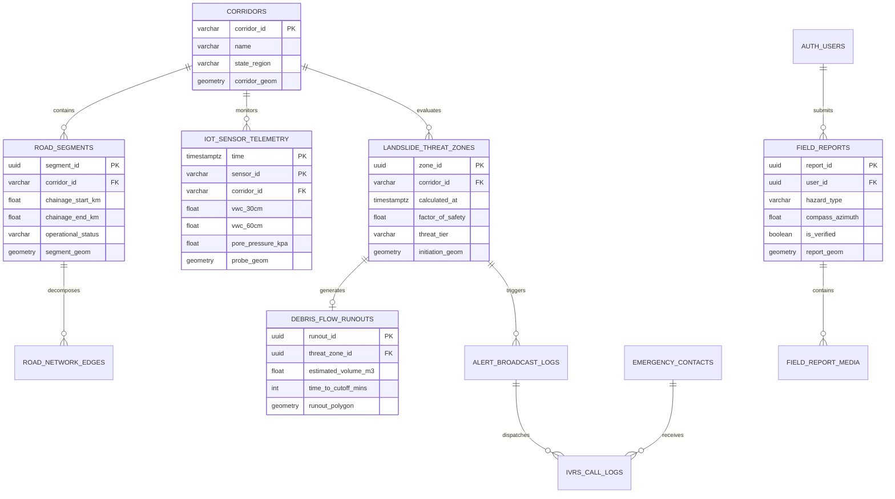

# TerraCast-NER: Supabase Database Architecture & Geospatial Data Engine
**Ministry of Development of North Eastern Region (MDoNER) | Problem Statement ID: 26001**

---

## 1. Overview & Supabase Platform Architecture

The **TerraCast-NER** persistence and real-time distribution tier is built on **Supabase** (Enterprise / Self-Hosted on AWS/GCP or Supabase Cloud), leveraging its unified ecosystem:

1. **Managed PostgreSQL 16 + PostGIS 3.4**: Robust open-source geospatial foundation executing spatial queries, topology management, R-tree GiST indexes, and distance calculations natively.
2. **Supabase Realtime (CDC)**: Broadcasts database mutations (new `landslide_threat_zones`, road `operational_status = 'BLOCKED'`, or emergency alerts) over WebSockets directly to Command Center browsers and field PWAs with sub-100ms latency.
3. **Supabase Auth & Row Level Security (RLS)**: Fine-grained, declarative security policies ensuring that citizens can submit field reports, verified field officers can validate them, and only authorized command officers can modify road operational statuses and dispatch alerts.
4. **Supabase Storage**: Integrated S3-compatible asset store with automatic image optimization for "Snap & Verify" high-resolution slope photos, drone orthomosaics, and InSAR GeoTIFFs.
5. **Database Webhooks & pg_cron**: Triggers automated HTTP webhooks to the FastAPI backend and schedules automated temporal maintenance (such as rolling partition cleanup and antecedent rainfall calculations).

```
+-----------------------------------------------------------------------------------+
| SUPABASE UNIFIED PLATFORM TIER                                                    |
+-----------------------------------------------------------------------------------+
|  [ Supabase Realtime Engine (Elixir / WebSockets) ]                               |
|  - Realtime CDC on 'landslide_threat_zones' -> Instant 3D Mapbox/Cesium Updates   |
|  - Broadcast highway closures to field PWAs and NDRF dispatchers                  |
+-----------------------------------------------------------------------------------+
|  [ Supabase Auth & Row Level Security (RLS) ]                                     |
|  - Built-in GoTrue JWT token verification                                         |
|  - Declarative RLS policies on tables for Citizens, Officers, and Admins          |
+-----------------------------------------------------------------------------------+
|  [ PostgreSQL 16 Engine with PostGIS 3.4 & Time Partitioning ]                    |
|  - PostGIS: ST_Intersects, ST_DWithin, ST_AsMVT (Vector Tile streaming)           |
|  - Time-Series Partitioning (pg_partman) for high-frequency IoT sensor telemetry  |
|  - PL/pgSQL Triggers: Automated road-cutoff intersection detection                |
+-----------------------------------------------------------------------------------+
|  [ Supabase Storage ]                                                             |
|  - Bucket 'field-reports' (Citizen/Officer hazard photos with RLS)               |
|  - Bucket 'sar-rasters' (Sentinel-1 / NISAR GeoTIFFs & DEM meshes)                |
+-----------------------------------------------------------------------------------+
|  [ Database Webhooks & pg_cron ]                                                  |
|  - On INSERT to 'debris_flow_runouts' -> Webhook to FastAPI /api/v1/routes        |
|  - pg_cron: Hourly Antecedent Precipitation Index (API_15) aggregation            |
+-----------------------------------------------------------------------------------+
```

---

## 2. Entity-Relationship (ER) Data Model



---

## 3. Production DDL & Schema Definitions (Supabase SQL)

Execute the following script within the **Supabase SQL Editor** to initialize the complete database environment:

```sql
-- ============================================================================
-- 1. SUPABASE EXTENSIONS SETUP
-- ============================================================================
CREATE EXTENSION IF NOT EXISTS "uuid-ossp";
CREATE EXTENSION IF NOT EXISTS "pgcrypto";
CREATE EXTENSION IF NOT EXISTS "postgis";
CREATE EXTENSION IF NOT EXISTS "postgis_topology";
CREATE EXTENSION IF NOT EXISTS "pg_cron";

-- ============================================================================
-- 2. HIGHWAY CORRIDORS & ROAD NETWORK
-- ============================================================================
CREATE TABLE public.corridors (
    corridor_id VARCHAR(32) PRIMARY KEY, -- e.g. 'NH-10', 'NH-29', 'NH-6'
    name VARCHAR(128) NOT NULL,
    state_region VARCHAR(64) NOT NULL,    -- e.g. 'Sikkim-West Bengal', 'Nagaland'
    total_length_km NUMERIC(6, 2) NOT NULL,
    corridor_geom GEOMETRY(MultiLineString, 4326) NOT NULL,
    created_at TIMESTAMPTZ DEFAULT NOW()
);
CREATE INDEX idx_corridors_geom ON public.corridors USING GIST(corridor_geom);

CREATE TABLE public.road_segments (
    segment_id UUID PRIMARY KEY DEFAULT gen_random_uuid(),
    corridor_id VARCHAR(32) REFERENCES public.corridors(corridor_id) ON DELETE CASCADE,
    segment_name VARCHAR(128) NOT NULL,
    chainage_start_km NUMERIC(6, 2) NOT NULL,
    chainage_end_km NUMERIC(6, 2) NOT NULL,
    operational_status VARCHAR(16) DEFAULT 'OPEN' 
        CHECK (operational_status IN ('OPEN', 'CONTROLLED', 'BLOCKED', 'EVACUATING')),
    speed_limit_kmh INTEGER DEFAULT 40,
    segment_geom GEOMETRY(LineString, 4326) NOT NULL,
    updated_at TIMESTAMPTZ DEFAULT NOW()
);
CREATE INDEX idx_road_segments_geom ON public.road_segments USING GIST(segment_geom);
CREATE INDEX idx_road_segments_status ON public.road_segments(operational_status);

-- ============================================================================
-- 3. IOT SENSOR TELEMETRY & PRECIPITATION (PARTITIONED TABLES)
-- ============================================================================
CREATE TABLE public.iot_sensor_telemetry (
    id BIGSERIAL,
    time TIMESTAMPTZ NOT NULL DEFAULT NOW(),
    sensor_id VARCHAR(64) NOT NULL,
    corridor_id VARCHAR(32) REFERENCES public.corridors(corridor_id),
    volumetric_water_content_30cm DOUBLE PRECISION,  -- Soil moisture theta at 30cm
    volumetric_water_content_60cm DOUBLE PRECISION,  -- Soil moisture theta at 60cm
    volumetric_water_content_120cm DOUBLE PRECISION, -- Soil moisture theta at 120cm
    pore_water_pressure_kpa DOUBLE PRECISION,        -- Dynamic pore pressure u_w
    battery_millivolts INTEGER,
    probe_geom GEOMETRY(Point, 4326) NOT NULL,
    PRIMARY KEY (id, time)
) PARTITION BY RANGE (time);

-- Create initial monthly partitions
CREATE TABLE public.iot_telemetry_y2026m09 PARTITION OF public.iot_sensor_telemetry
    FOR VALUES FROM ('2026-09-01') TO ('2026-10-01');
CREATE TABLE public.iot_telemetry_y2026m10 PARTITION OF public.iot_sensor_telemetry
    FOR VALUES FROM ('2026-10-01') TO ('2026-11-01');

CREATE INDEX idx_iot_geom ON public.iot_sensor_telemetry USING GIST(probe_geom);
CREATE INDEX idx_iot_sensor_time ON public.iot_sensor_telemetry(sensor_id, time DESC);

CREATE TABLE public.rainfall_timeseries (
    id BIGSERIAL,
    time TIMESTAMPTZ NOT NULL DEFAULT NOW(),
    grid_cell_id VARCHAR(64) NOT NULL,
    source VARCHAR(16) CHECK (source IN ('IMD_GRIDDED', 'NASA_GPM', 'AWS_GROUND')),
    precipitation_mm_hour DOUBLE PRECISION NOT NULL,
    accumulated_24h_mm DOUBLE PRECISION,
    grid_geom GEOMETRY(Polygon, 4326) NOT NULL,
    PRIMARY KEY (id, time)
) PARTITION BY RANGE (time);

CREATE TABLE public.rainfall_y2026m09 PARTITION OF public.rainfall_timeseries
    FOR VALUES FROM ('2026-09-01') TO ('2026-10-01');

CREATE INDEX idx_rainfall_geom ON public.rainfall_timeseries USING GIST(grid_geom);
CREATE INDEX idx_rainfall_cell ON public.rainfall_timeseries(grid_cell_id, time DESC);

-- ============================================================================
-- 4. LANDSLIDE THREAT ZONES & DEBRIS FLOW RUNOUTS
-- ============================================================================
CREATE TABLE public.landslide_threat_zones (
    zone_id UUID PRIMARY KEY DEFAULT gen_random_uuid(),
    corridor_id VARCHAR(32) REFERENCES public.corridors(corridor_id),
    location_name VARCHAR(128) NOT NULL,
    calculated_at TIMESTAMPTZ NOT NULL DEFAULT NOW(),
    factor_of_safety NUMERIC(4, 2) NOT NULL,
    threat_tier VARCHAR(16) NOT NULL 
        CHECK (threat_tier IN ('NORMAL', 'ADVISORY', 'WARNING', 'CRITICAL')),
    trigger_probability NUMERIC(4, 3) NOT NULL,
    pore_water_pressure_kpa DOUBLE PRECISION NOT NULL,
    estimated_slip_depth_m NUMERIC(4, 2) NOT NULL,
    initiation_geom GEOMETRY(Polygon, 4326) NOT NULL
);
CREATE INDEX idx_threat_zones_initiation ON public.landslide_threat_zones USING GIST(initiation_geom);
CREATE INDEX idx_threat_zones_tier ON public.landslide_threat_zones(threat_tier);
CREATE INDEX idx_threat_zones_corridor ON public.landslide_threat_zones(corridor_id, calculated_at DESC);

CREATE TABLE public.debris_flow_runouts (
    runout_id UUID PRIMARY KEY DEFAULT gen_random_uuid(),
    threat_zone_id UUID REFERENCES public.landslide_threat_zones(zone_id) ON DELETE CASCADE,
    estimated_volume_m3 DOUBLE PRECISION NOT NULL,
    peak_flow_velocity_ms DOUBLE PRECISION NOT NULL,
    time_to_cutoff_mins INTEGER NOT NULL,
    max_deposition_depth_m NUMERIC(4, 2) NOT NULL,
    severed_chainage_km NUMERIC(6, 2),
    runout_polygon GEOMETRY(Polygon, 4326) NOT NULL,
    created_at TIMESTAMPTZ DEFAULT NOW()
);
CREATE INDEX idx_runouts_polygon ON public.debris_flow_runouts USING GIST(runout_polygon);

-- ============================================================================
-- 5. FIELD REPORTS (INTEGRATED WITH SUPABASE AUTH)
-- ============================================================================
CREATE TABLE public.field_reports (
    report_id UUID PRIMARY KEY DEFAULT gen_random_uuid(),
    client_uuid VARCHAR(64) UNIQUE NOT NULL,
    user_id UUID REFERENCES auth.users(id) ON DELETE SET NULL,
    submitted_at TIMESTAMPTZ NOT NULL DEFAULT NOW(),
    reporter_phone VARCHAR(20),
    reporter_role VARCHAR(32) DEFAULT 'CITIZEN' 
        CHECK (reporter_role IN ('CITIZEN', 'VDMC_MEMBER', 'POLICE_PATROL', 'BRO_OFFICER')),
    hazard_type VARCHAR(32) NOT NULL 
        CHECK (hazard_type IN ('TENSION_CRACK', 'ROCKFALL', 'ROAD_SUBSIDENCE', 'MUD_FLOW')),
    compass_azimuth_degrees NUMERIC(5, 2),
    slope_tilt_degrees NUMERIC(4, 2),
    is_verified BOOLEAN DEFAULT FALSE,
    anti_spoofing_status VARCHAR(16) DEFAULT 'VALID' 
        CHECK (anti_spoofing_status IN ('VALID', 'SUSPECT_LOCATION', 'EXIF_TAMPERED')),
    notes TEXT,
    photo_storage_paths TEXT[], -- References Supabase Storage bucket 'field-reports'
    report_geom GEOMETRY(Point, 4326) NOT NULL
);
CREATE INDEX idx_field_reports_geom ON public.field_reports USING GIST(report_geom);
CREATE INDEX idx_field_reports_time ON public.field_reports(submitted_at DESC);

-- ============================================================================
-- 6. EMERGENCY CONTACTS & DISPATCH LOGS
-- ============================================================================
CREATE TABLE public.emergency_contacts (
    contact_id UUID PRIMARY KEY DEFAULT gen_random_uuid(),
    corridor_id VARCHAR(32) REFERENCES public.corridors(corridor_id),
    full_name VARCHAR(128) NOT NULL,
    phone_number VARCHAR(20) NOT NULL,
    role VARCHAR(32) NOT NULL, -- e.g. 'SARPANCH', 'TRUCK_UNION_LEAD', 'NDRF_NODAL'
    preferred_language VARCHAR(16) DEFAULT 'en' 
        CHECK (preferred_language IN ('en', 'khasi', 'mizo', 'assamese', 'bodo', 'garo', 'hindi', 'nepali')),
    home_geom GEOMETRY(Point, 4326) NOT NULL
);
CREATE INDEX idx_contacts_geom ON public.emergency_contacts USING GIST(home_geom);

CREATE TABLE public.alert_broadcast_logs (
    broadcast_id UUID PRIMARY KEY DEFAULT gen_random_uuid(),
    threat_zone_id UUID REFERENCES public.landslide_threat_zones(zone_id),
    dispatched_at TIMESTAMPTZ DEFAULT NOW(),
    threat_tier VARCHAR(16) NOT NULL,
    total_calls_initiated INTEGER DEFAULT 0,
    total_sms_dispatched INTEGER DEFAULT 0,
    target_geofence_polygon GEOMETRY(Polygon, 4326) NOT NULL
);
```

---

## 4. Supabase Row Level Security (RLS) Policies

Supabase enforces strict zero-trust security at the database engine level via Row Level Security (RLS):

```sql
-- Enable RLS on core tables
ALTER TABLE public.corridors ENABLE ROW LEVEL SECURITY;
ALTER TABLE public.road_segments ENABLE ROW LEVEL SECURITY;
ALTER TABLE public.landslide_threat_zones ENABLE ROW LEVEL SECURITY;
ALTER TABLE public.debris_flow_runouts ENABLE ROW LEVEL SECURITY;
ALTER TABLE public.field_reports ENABLE ROW LEVEL SECURITY;
ALTER TABLE public.emergency_contacts ENABLE ROW LEVEL SECURITY;

-- 1. Public Read Access for Corridors, Threat Zones, and Road Status
CREATE POLICY "Public Read: Corridors" ON public.corridors
    FOR SELECT USING (true);

CREATE POLICY "Public Read: Road Segments" ON public.road_segments
    FOR SELECT USING (true);

CREATE POLICY "Public Read: Threat Zones" ON public.landslide_threat_zones
    FOR SELECT USING (true);

CREATE POLICY "Public Read: Debris Runouts" ON public.debris_flow_runouts
    FOR SELECT USING (true);

-- 2. Field Reports: Citizens can INSERT; Only authenticated Officers can UPDATE/VERIFY
CREATE POLICY "Citizens and Public can submit reports" ON public.field_reports
    FOR INSERT WITH CHECK (true);

CREATE POLICY "Public can view verified reports" ON public.field_reports
    FOR SELECT USING (is_verified = true OR auth.uid() = user_id);

CREATE POLICY "Officers can view and verify all reports" ON public.field_reports
    FOR ALL USING (
        auth.jwt() ->> 'role' IN ('COMMAND_OFFICER', 'FIELD_INSPECTOR', 'SUPER_ADMIN')
    );

-- 3. Only Command Center Admins can mutate Road Operational Status
CREATE POLICY "Admins manage road operational status" ON public.road_segments
    FOR UPDATE USING (
        auth.jwt() ->> 'role' IN ('COMMAND_OFFICER', 'SUPER_ADMIN')
    );

-- 4. Emergency Contacts: Protected PII accessible only to Command Dispatchers
CREATE POLICY "Commanders view emergency contacts" ON public.emergency_contacts
    FOR SELECT USING (
        auth.jwt() ->> 'role' IN ('COMMAND_OFFICER', 'SUPER_ADMIN')
    );
```

---

## 5. Supabase Realtime Configuration

Enable PostgreSQL Change Data Capture (CDC) replication for real-time frontend synchronization:

```sql
-- Add critical tables to Supabase Realtime publication
ALTER PUBLICATION supabase_realtime ADD TABLE public.landslide_threat_zones;
ALTER PUBLICATION supabase_realtime ADD TABLE public.road_segments;
ALTER PUBLICATION supabase_realtime ADD TABLE public.field_reports;
ALTER PUBLICATION supabase_realtime ADD TABLE public.alert_broadcast_logs;
```

### Client-Side Realtime Subscription (TypeScript / `@supabase/supabase-js`)
```typescript
import { createClient } from '@supabase/supabase-js';

const supabase = createClient(
  process.env.NEXT_PUBLIC_SUPABASE_URL!,
  process.env.NEXT_PUBLIC_SUPABASE_ANON_KEY!
);

// Subscribe to Critical Hazard & Road Closure mutations
export const subscribeToCorridorAlerts = (corridorId: string, onUpdate: (payload: any) => void) => {
  return supabase
    .channel(`alerts:${corridorId}`)
    .on(
      'postgres_changes',
      {
        event: 'INSERT',
        schema: 'public',
        table: 'landslide_threat_zones',
        filter: `corridor_id=eq.${corridorId}`,
      },
      (payload) => {
        if (payload.new.threat_tier === 'CRITICAL') {
          console.warn('REALTIME CRITICAL THREAT DETECTED:', payload.new);
          onUpdate(payload.new);
        }
      }
    )
    .on(
      'postgres_changes',
      {
        event: 'UPDATE',
        schema: 'public',
        table: 'road_segments',
        filter: `corridor_id=eq.${corridorId}`,
      },
      (payload) => {
        if (payload.new.operational_status === 'BLOCKED') {
          console.error('HIGHWAY SEGMENT BLOCKED:', payload.new.segment_name);
          onUpdate(payload.new);
        }
      }
    )
    .subscribe();
};
```

---

## 6. Automated Spatial Triggers & Highway Severance Function

```sql
CREATE OR REPLACE FUNCTION public.trigger_highway_cutoff_detection()
RETURNS TRIGGER AS $$
DECLARE
    r_segment RECORD;
BEGIN
    -- Detect road segments intersected by newly inserted debris runout polygon
    FOR r_segment IN 
        SELECT segment_id, segment_name, chainage_start_km, chainage_end_km
        FROM public.road_segments
        WHERE ST_Intersects(segment_geom, NEW.runout_polygon)
    LOOP
        -- Automatically elevate segment status to BLOCKED
        UPDATE public.road_segments 
        SET operational_status = 'BLOCKED', updated_at = NOW()
        WHERE segment_id = r_segment.segment_id;

        RAISE NOTICE 'SUPABASE AUTO-TRIGGER: Highway Segment % severed by Runout %', 
            r_segment.segment_name, NEW.runout_id;
    END LOOP;

    RETURN NEW;
END;
$$ LANGUAGE plpgsql SECURITY DEFINER;

CREATE TRIGGER trg_debris_runout_severance
AFTER INSERT ON public.debris_flow_runouts
FOR EACH ROW
EXECUTE FUNCTION public.trigger_highway_cutoff_detection();
```

---

## 7. Supabase Storage Buckets & Policies

Set up dedicated storage buckets for field media and satellite rasters:

```sql
-- 1. Create Storage Buckets
INSERT INTO storage.buckets (id, name, public) 
VALUES 
    ('field-reports', 'field-reports', true),
    ('sar-rasters', 'sar-rasters', false)
ON CONFLICT (id) DO NOTHING;

-- 2. Storage RLS: Anyone can upload a field report photo; Authenticated users can read
CREATE POLICY "Public Upload Field Photos" ON storage.objects
    FOR INSERT WITH CHECK (bucket_id = 'field-reports');

CREATE POLICY "Public Read Field Photos" ON storage.objects
    FOR SELECT USING (bucket_id = 'field-reports');

CREATE POLICY "Admins Manage SAR Rasters" ON storage.objects
    FOR ALL USING (
        bucket_id = 'sar-rasters' AND
        auth.jwt() ->> 'role' IN ('COMMAND_OFFICER', 'SUPER_ADMIN')
    );
```

---

## 8. Dynamic Vector Tile Generation Query (`ST_AsMVT`)

Expose high-performance Mapbox Vector Tiles (`.mvt`) directly from Supabase via Database Function (RPC) for the Cesium/Mapbox frontend:

```sql
CREATE OR REPLACE FUNCTION public.mvt_active_threat_zones(z integer, x integer, y integer)
RETURNS bytea AS $$
DECLARE
    mvt bytea;
BEGIN
    WITH bounds AS (
        SELECT ST_TileEnvelope(z, x, y) AS geom
    ),
    mvtgeom AS (
        SELECT 
            t.zone_id,
            t.corridor_id,
            t.factor_of_safety,
            t.threat_tier,
            t.trigger_probability,
            ST_AsMVTGeom(ST_Transform(t.initiation_geom, 3857), bounds.geom) AS geom
        FROM public.landslide_threat_zones t, bounds
        WHERE ST_Intersects(ST_Transform(t.initiation_geom, 3857), bounds.geom)
          AND t.calculated_at >= (NOW() - INTERVAL '24 hours')
    )
    SELECT ST_AsMVT(mvtgeom, 'active_threat_zones') INTO mvt FROM mvtgeom;
    RETURN mvt;
END;
$$ LANGUAGE plpgsql STABLE PARALLEL SAFE SECURITY DEFINER;
```
