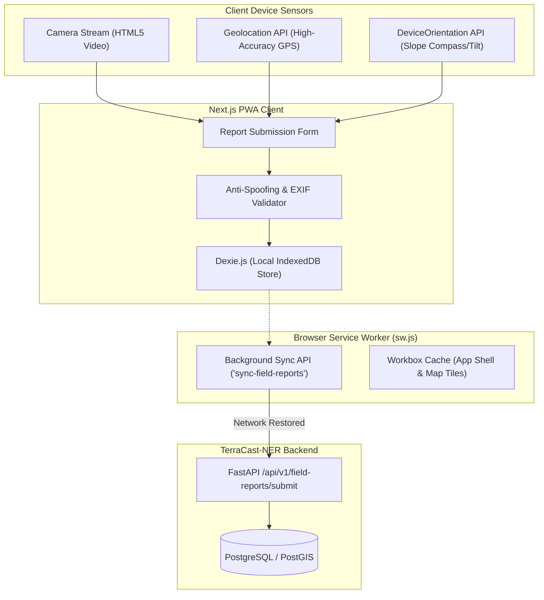

# TerraCast-NER: Frontend Architecture & Client Implementation
**Ministry of Development of North Eastern Region (MDoNER) | Problem Statement ID: 26001**

---

## 1. Overview & UI Engineering Philosophy

The **TerraCast-NER** frontend delivers a dual-interface architecture designed for extreme operating conditions across the North Eastern Region:
1. **Command Center 3D GIS**: A mission-critical geospatial digital twin optimized for high-resolution monitors in state disaster management authorities (SDMAs), BRO headquarters, and NDRF battalion command rooms.
2. **"Snap & Verify" Offline Field PWA**: A resilient, offline-first Progressive Web Application engineered for low-cost Android smartphones used by field patrollers, village disaster committees, and police units operating in zero-connectivity Himalayan valleys.

### Core Technology Stack
* **Framework**: Next.js 14 (App Router, Server & Client Components), TypeScript 5.4.
* **Styling & UI**: Tailwind CSS 3.4, Shadcn UI (Radix Primitives), Lucide React.
* **3D Geospatial Engine**: CesiumJS 1.115 / Resium + Mapbox GL JS v3 (terrain elevation meshes, 3D tiles, and vector tile streaming).
* **Offline Storage**: Dexie.js (IndexedDB wrapper) + Workbox 7.0 Service Workers.
* **Database & Realtime Client**: `@supabase/supabase-js` (Auth, Storage, and Realtime WebSocket CDC channels).
* **State Management**: Zustand (ephemeral and client state) + TanStack Query v5 (server state caching).
* **Live Communications**: Supabase Realtime Channels (PostgreSQL WAL streaming with automatic reconnect).

---

## 2. Directory Structure

```text
frontend/
├── public/
│   ├── assets/                 # Regional audio samples, static logos, terrain fixtures
│   ├── icons/                  # PWA icons (192x192, 512x512, maskable)
│   ├── manifest.json           # PWA web app manifest
│   └── sw.js                   # Custom Service Worker (Workbox & Background Sync)
├── src/
│   ├── app/                    # Next.js 14 App Router
│   │   ├── (auth)/             # Login, 2FA, session verification
│   │   ├── (dashboard)/        # 3D Command Center main views
│   │   │   ├── page.tsx        # Primary 3D GIS Digital Twin
│   │   │   ├── corridors/      # Highway-specific views (NH-10, NH-29, NH-6)
│   │   │   ├── routes/         # Safe corridor rerouting & convoy planner
│   │   │   └── analytics/      # Historical rainfall vs displacement curves
│   │   ├── (field)/            # "Snap & Verify" PWA routes
│   │   │   ├── report/         # Offline camera & hazard capture
│   │   │   └── queue/          # Unsynced reports status & history
│   │   ├── layout.tsx          # Root layout with providers & regional font loaders
│   │   └── globals.css         # Tailwind tokens, mapbox/cesium CSS overrides
│   ├── components/
│   │   ├── gis/                # Geospatial visualization components
│   │   │   ├── CesiumViewer.tsx       # 3D Terrain & Digital Twin Canvas
│   │   │   ├── MapboxLayer.tsx        # 2D Vector Tile Fallback
│   │   │   ├── LayerToggles.tsx       # InSAR, FS, Runout, IoT overlays
│   │   │   ├── TimelineSlider.tsx     # 4D Historical & Forecast Scrubber
│   │   │   └── RouteVisualizer.tsx    # OSRM Safe Bypass Itinerary Overlay
│   │   ├── field/              # PWA field components
│   │   │   ├── CameraCapture.tsx      # MediaDevices video stream & EXIF capture
│   │   │   ├── OrientationGauge.tsx   # Compass & slope angle gyro HUD
│   │   │   └── SyncStatusBadge.tsx    # Online/Offline & pending queue indicator
│   │   ├── ui/                 # Reusable Shadcn UI primitives (Buttons, Modals, Tabs)
│   │   └── alert/              # Emergency banners, audio chime modal, IVRS logs
│   ├── hooks/                  # Custom React hooks
│   │   ├── useCesium.ts        # Cesium scene lifecycle & camera fly-to bindings
│   │   ├── useIndexedDB.ts     # Dexie report queue interactions
│   │   ├── useNetworkStatus.ts # Navigator online/offline event listener
│   │   ├── useGeolocation.ts   # High-accuracy GPS watcher with Kalman filter
│   │   └── useWebSocket.ts     # Real-time telemetry & critical alert listener
│   ├── stores/                 # Zustand state stores
│   │   ├── useHazardStore.ts   # Active threat zones, selected corridor, FS matrices
│   │   ├── useRouteStore.ts    # Calculated safe bypass routes, checkpoints
│   │   └── usePWAStore.ts      # Offline storage queue count, sync state
│   ├── lib/                    # Utilities & clients
│   │   ├── api.ts              # Axios/Fetch wrapper with JWT refresh interceptors
│   │   ├── db.ts               # Dexie.js database definition
│   │   ├── geo.ts              # Turf.js spatial helpers (distance, buffers, azimuth)
│   │   └── i18n/               # Regional translations (Khasi, Mizo, Assamese, etc.)
│   └── types/                  # TypeScript interface declarations
│       ├── gis.d.ts            # GeoJSON, ThreatZone, FSGrid types
│       ├── telemetry.d.ts      # IoT Sensor payload schemas
│       └── pwa.d.ts            # Offline report record definitions
├── next.config.mjs             # Next.js config with Cesium webpack copy plugins
├── tailwind.config.ts          # Color palettes, custom animations
└── tsconfig.json
```

---

## 3. 3D GIS Command Center Implementation

```
+---------------------------------------------------------------------------------------------------+
|  TerraCast-NER Command Center  [Corridor: NH-10 (Sevoke-Gangtok)] [Live WebSocket: CONNECTED]    |
+---------------------------------------------------------------------------------------------------+
|  [ LAYER CONTROLS ]        |  [ 3D TERRAIN DIGITAL TWIN: CesiumJS / Resium ]                      |
|  [x] CartoDEM 10m Elevation|                                                                      |
|  [x] InSAR LOS Velocity    |            /\                                                        |
|  [x] Factor of Safety (FS) |           /  \      [Critical Slip Zone: KM 29.4]                    |
|  [x] Cut-Slope Hazards     |          / /\ \     FS = 0.88 (Imminent Shear Failure)               |
|  [x] IoT Probes (Live)     |         / /  \ \    Debris Volume: 5,200 m^3                         |
|  [x] Convoy Safe Routes    |        /_/    \_\   Time to Cutoff: 18 mins                          |
|  ------------------------- |      ================[ HIGHWAY BLOCKED ]=====================        |
|  [ REGIONAL LOCALE ]       |                        \                                             |
|  [ Khasi | Mizo | Asm ]    |                         \---> [ SAFE CONVOY BYPASS ROUTE ]           |
|  ------------------------- |                               (Siliguri -> Lava -> Gangtok)          |
|  [ TIMELINE PLAYBACK ]     |                                                                      |
|  [<]  [||]  [>]  [ 14:00 ] |  Lat: 26.9851° N | Lon: 88.4612° E | Elev: 642 m | Bandwidth: 450 kbps|
+---------------------------------------------------------------------------------------------------+
|  ACTIVE ALERTS: Critical (2) | Advisories (4) | Convoys Active (3) | Automated IVRS Calls: 1,420  |
+---------------------------------------------------------------------------------------------------+
```

### 3.1 CesiumJS 3D Terrain & Layer Overlay Engine
The core visualization engine combines **CartoDEM 10m** terrain meshes with real-time vector and raster layers:

```typescript
// src/components/gis/CesiumViewer.tsx
'use client';

import React, { useEffect, useRef } from 'react';
import * as Cesium from 'cesium';
import { useHazardStore } from '@/stores/useHazardStore';

export const CesiumViewer: React.FC = () => {
  const containerRef = useRef<HTMLDivElement>(null);
  const viewerRef = useRef<Cesium.Viewer | null>(null);
  const { selectedCorridor, activeLayers } = useHazardStore();

  useEffect(() => {
    if (!containerRef.current) return;

    // Initialize Cesium 3D Terrain Viewer
    const viewer = new Cesium.Viewer(containerRef.current, {
      terrainProvider: new Cesium.CesiumTerrainProvider({
        url: '/api/v1/tiles/cartodem-terrain-mesh',
        requestVertexNormals: true,
      }),
      baseLayerPicker: false,
      geocoder: false,
      homeButton: false,
      timeline: false,
      animation: false,
      sceneModePicker: false,
      navigationHelpButton: false,
    });

    viewer.scene.globe.enableLighting = true;
    viewer.scene.globe.depthTestAgainstTerrain = true;
    viewerRef.current = viewer;

    // Fly camera to target corridor (e.g., NH-10 Teesta Valley)
    viewer.camera.flyTo({
      destination: Cesium.Cartesian3.fromDegrees(88.4612, 26.9851, 3500),
      orientation: {
        heading: Cesium.Math.toRadians(15.0),
        pitch: Cesium.Math.toRadians(-35.0),
        roll: 0.0,
      },
      duration: 2.5,
    });

    return () => {
      viewer.destroy();
    };
  }, []);

  // Update Dynamic Factor of Safety (FS) Heatmap Overlay
  useEffect(() => {
    const viewer = viewerRef.current;
    if (!viewer || !activeLayers.factorOfSafety) return;

    const fsImageryLayer = viewer.imageryLayers.addImageryProvider(
      new Cesium.UrlTemplateImageryProvider({
        url: `/api/v1/tiles/fs-heatmap/{z}/{x}/{y}.png?corridor=${selectedCorridor}`,
        maximumLevel: 18,
      })
    );
    fsImageryLayer.alpha = 0.75;

    return () => {
      viewer.imageryLayers.remove(fsImageryLayer);
    };
  }, [selectedCorridor, activeLayers.factorOfSafety]);

  return <div ref={containerRef} className="w-full h-full relative" />;
};
```

### 3.2 4D Historical & Forecast Timeline Scrubber
Enables disaster managers to scrub through the past 72 hours of antecedent rainfall and pore-water pressure accumulation, as well as project forward 24 hours of forecast precipitation to observe predicted slope failure evolution.

---

## 4. "Snap & Verify" Offline-First Field PWA



### 4.1 IndexedDB Schema (Dexie.js)
```typescript
// src/lib/db.ts
import Dexie, { Table } from 'dexie';

export interface OfflineReport {
  id?: number;
  uuid: string;
  timestamp: string;
  latitude: number;
  longitude: number;
  altitudeMeters: number;
  compassAzimuthDegrees: number;
  slopeTiltAngleDegrees: number;
  hazardType: 'TENSION_CRACK' | 'ROCKFALL' | 'ROAD_SUBSIDENCE' | 'MUD_FLOW';
  severityEstimate: 'LOW' | 'MEDIUM' | 'HIGH' | 'CRITICAL';
  notes: string;
  photoBlob: Blob;
  syncStatus: 'PENDING' | 'SYNCING' | 'SYNCED' | 'FAILED';
  retryCount: number;
}

export class TerraCastDB extends Dexie {
  reports!: Table<OfflineReport>;

  constructor() {
    super('TerraCastFieldDB');
    this.version(1).stores({
      reports: '++id, uuid, timestamp, syncStatus, hazardType',
    });
  }
}

export const db = new TerraCastDB();
```

### 4.2 Background Sync Service Worker Implementation
```javascript
// public/sw.js
import { precacheAndRoute } from 'workbox-precaching';
import { registerRoute } from 'workbox-routing';
import { NetworkFirst, CacheFirst } from 'workbox-strategies';

precacheAndRoute(self.__WB_MANIFEST || []);

// Cache vector and elevation tiles for offline map navigation
registerRoute(
  ({ url }) => url.pathname.startsWith('/api/v1/tiles/'),
  new CacheFirst({
    cacheName: 'terracast-tiles-cache',
    plugins: [{ maxEntries: 2000, maxAgeSeconds: 30 * 24 * 60 * 60 }],
  })
);

// Listen for Background Sync Events
self.addEventListener('sync', (event) => {
  if (event.tag === 'sync-field-reports') {
    event.waitUntil(flushPendingReports());
  }
});

async function flushPendingReports() {
  const db = new IDBDatabase('TerraCastFieldDB'); // IndexedDB lookup
  const pendingReports = await getPendingReports(db);

  for (const report of pendingReports) {
    const formData = new FormData();
    formData.append('uuid', report.uuid);
    formData.append('latitude', report.latitude.toString());
    formData.append('longitude', report.longitude.toString());
    formData.append('azimuth', report.compassAzimuthDegrees.toString());
    formData.append('hazard_type', report.hazardType);
    formData.append('photo', report.photoBlob, 'hazard.jpg');

    try {
      const response = await fetch('/api/v1/field-reports/submit', {
        method: 'POST',
        body: formData,
      });

      if (response.ok) {
        await markReportAsSynced(db, report.id);
      }
    } catch (err) {
      console.error('Sync failed, will retry on next network poll', err);
    }
  }
}
```

---

## 5. State Management & Real-Time Telemetry

### 5.1 Global Hazard Store (Zustand)
```typescript
// src/stores/useHazardStore.ts
import { create } from 'zustand';

interface HazardState {
  selectedCorridor: string;
  activeTiers: Array<'NORMAL' | 'ADVISORY' | 'WARNING' | 'CRITICAL'>;
  activeLayers: {
    cartoDem: boolean;
    insarVelocity: boolean;
    factorOfSafety: boolean;
    cutSlopes: boolean;
    iotSensors: boolean;
    safeCorridor: boolean;
  };
  criticalZonesCount: number;
  setSelectedCorridor: (corridor: string) => void;
  toggleLayer: (layerName: keyof HazardState['activeLayers']) => void;
  updateCriticalCount: (count: number) => void;
}

export const useHazardStore = create<HazardState>((set) => ({
  selectedCorridor: 'NH-10',
  activeTiers: ['WARNING', 'CRITICAL'],
  activeLayers: {
    cartoDem: true,
    insarVelocity: true,
    factorOfSafety: true,
    cutSlopes: true,
    iotSensors: true,
    safeCorridor: true,
  },
  criticalZonesCount: 0,
  setSelectedCorridor: (corridor) => set({ selectedCorridor: corridor }),
  toggleLayer: (layer) =>
    set((state) => ({
      activeLayers: { ...state.activeLayers, [layer]: !state.activeLayers[layer] },
    })),
  updateCriticalCount: (count) => set({ criticalZonesCount: count }),
}));
```

### 5.2 Supabase Realtime Telemetry & Alert Hook
```typescript
// src/hooks/useSupabaseRealtime.ts
import { useEffect } from 'react';
import { createClient } from '@supabase/supabase-js';
import { useHazardStore } from '@/stores/useHazardStore';

const supabase = createClient(
  process.env.NEXT_PUBLIC_SUPABASE_URL!,
  process.env.NEXT_PUBLIC_SUPABASE_ANON_KEY!
);

export const useSupabaseRealtime = () => {
  const { selectedCorridor, updateCriticalCount } = useHazardStore();

  useEffect(() => {
    // Listen to real-time PostgreSQL CDC events from Supabase Realtime
    const channel = supabase
      .channel(`hazard-feed:${selectedCorridor}`)
      .on(
        'postgres_changes',
        {
          event: 'INSERT',
          schema: 'public',
          table: 'landslide_threat_zones',
          filter: `corridor_id=eq.${selectedCorridor}`,
        },
        (payload) => {
          if (payload.new.threat_tier === 'CRITICAL') {
            playEmergencyChime();
            updateCriticalCount((prev) => prev + 1);
          }
        }
      )
      .on(
        'postgres_changes',
        {
          event: 'UPDATE',
          schema: 'public',
          table: 'road_segments',
          filter: `corridor_id=eq.${selectedCorridor}`,
        },
        (payload) => {
          if (payload.new.operational_status === 'BLOCKED') {
            console.warn('ROAD CUTOFF EVENT:', payload.new.segment_name);
            playEmergencyChime();
          }
        }
      )
      .subscribe();

    return () => {
      supabase.removeChannel(channel);
    };
  }, [selectedCorridor, updateCriticalCount]);
};

function playEmergencyChime() {
  const audio = new Audio('/assets/emergency_alert.mp3');
  audio.play().catch(() => {});
}
```

---

## 6. Multi-Lingual Regional Localization (i18n)

The application provides real-time dialect switching across official and tribal languages of the North Eastern Region:

```typescript
// src/lib/i18n/translations.ts
export const translations = {
  en: {
    critical_alert: 'CRITICAL ALERT: Imminent Landslide Triggered',
    road_blocked: 'Highway Blocked. Evacuate Corridor Immediately.',
    safe_bypass: 'Safe Convoy Bypass Available via',
  },
  khasi: {
    critical_alert: 'KHLAB KABA JUR: Ka jingtwad khyndew kaba khraw kala sdang',
    road_blocked: 'Ka surok kala sahkut. Mih noh kloi na katei ka jaka.',
    safe_bypass: 'Ka surok kaba shngain ban leit lyngba',
  },
  mizo: {
    critical_alert: 'HMINGTHIANG HLUAWHNA: Leimin hlauhawm a thleng mek',
    road_blocked: 'Kawng a ping. Chhuak nghal vat rawh.',
    safe_bypass: 'Kawng him zawk chu',
  },
  assamese: {
    critical_alert: 'জৰুৰী সতৰ্কতা: ভূমিস্খলনৰ গভীৰ আশংকা',
    road_blocked: 'ৰাষ্ট্ৰীয় ঘাইপথ বন্ধ। অবিলম্বে অঞ্চল ত্যাগ কৰক।',
    safe_bypass: 'সুৰক্ষিত বিকল্প পথ',
  },
  bodo: {
    critical_alert: 'गोख्रों खौरां: हा दैखांनायनि गिथावना जाथाय',
    road_blocked: 'राजलामा बन्द जाबाय। थाबनो जायगा गारनानै थां।',
    safe_bypass: 'रैखागोनां लामा',
  },
  garo: {
    critical_alert: 'KENBEGNIGIPA: A·a be·ani a·bachengengaha',
    road_blocked: 'Rama chipaha. Bakan a·dokko watbo.',
    safe_bypass: 'Jokani ramako jakkalbo',
  },
};
```

---

## 7. Performance & Low-Bandwidth Optimizations

1. **Progressive 3D Degradation**: If client network drops below $256\text{ kbps}$ or packet loss exceeds $15\%$, the app dynamically switches from 3D Cesium terrain meshes to lightweight 2D Mapbox Vector Tiles (`.mvt`).
2. **Bundle Chunking**: CesiumJS and Mapbox libraries are dynamically loaded via `next/dynamic` only when the map canvas mounts, reducing initial bundle size to $< 180\text{ kB}$.
3. **PWA Manifest (`public/manifest.json`)**: Preconfigures standalone installation on field Android smartphones with hardware camera and orientation permissions.
