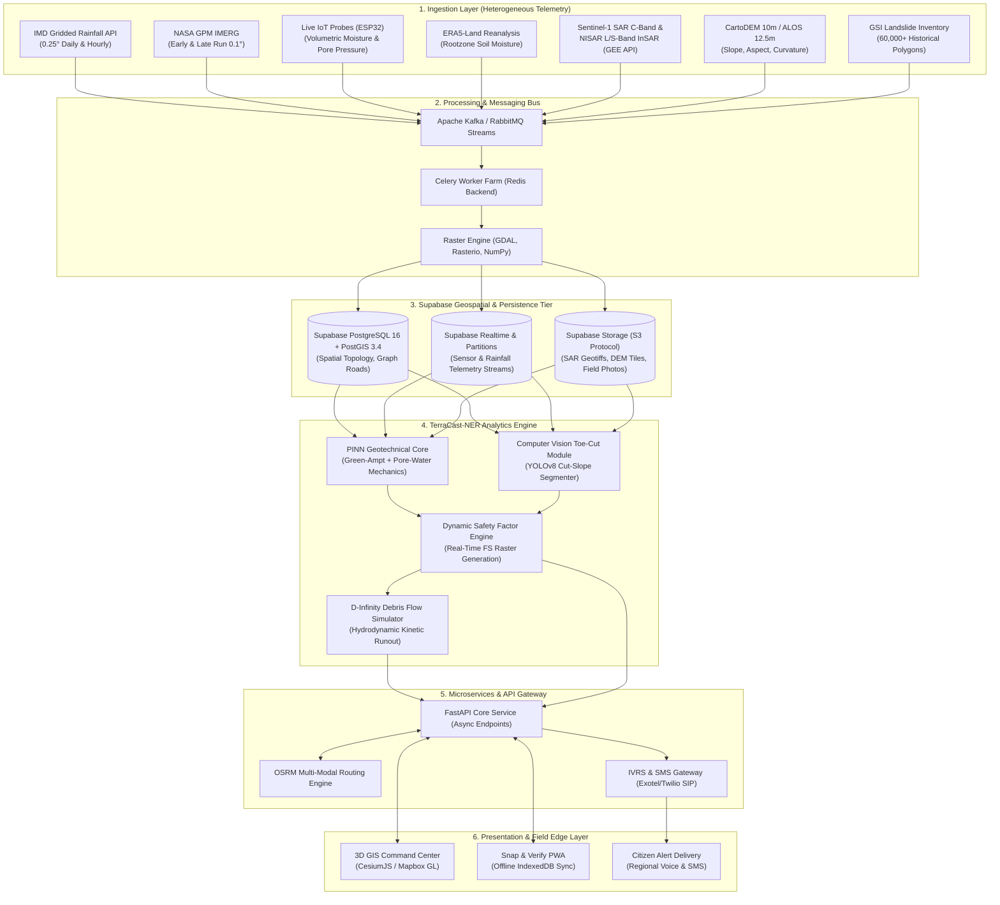
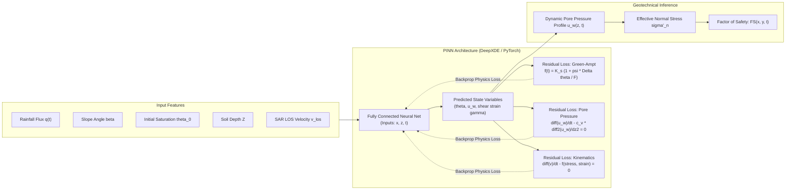
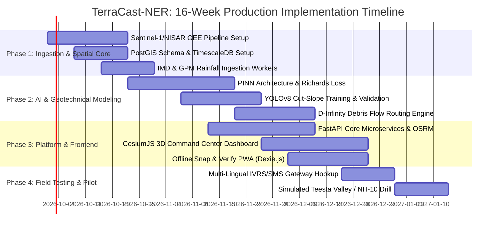

# TerraCast-NER: Physics-Informed Real-Time Landslide Early Warning & Safe Corridor System
**Ministry of Development of North Eastern Region (MDoNER) | Problem Statement ID: 26001**

---

## 1. Executive Summary & Problem Framing

### 1.1 Target Region & Geo-Strategic Criticality
The North Eastern Region (NER) of India represents one of the world's most landslide-vulnerable geodynamic landscapes, characterized by active Himalayan tectonics, steep terrain relief, fragile sedimentary lithology, and torrential monsoon precipitation (1,500 mm to 11,000+ mm annually in Cherrapunji/Mawsynram corridors).

Landslides in the NER routinely sever critical supply lifelines, isolate entire states, and delay disaster response by days. **TerraCast-NER** prioritizes three vulnerable national highway corridors:
* **NH-10 (Siliguri - Sevoke - Gangtok)**: The sole economic and military artery connecting Sikkim to the rest of India, prone to catastrophic slope destabilization along the Teesta River gorge (e.g., 29th Mile, Selfie Danda).
* **NH-29 (Dimapur - Kohima - Imphal)**: The lifeline traversing Nagaland and Manipur, susceptible to creeping mudslides, road subsidence (e.g., Pagla Pahar, Old KMC dumping site), and heavy freight cutoffs.
* **NH-6 (Guwahati - Shillong - Silchar - Aizawl - Agartala)**: Trans-Meghalaya/Assam economic transit lifeline through the East Jaintia Hills and Cachar belt, repeatedly blocked by debris avalanches during peak monsoon.

```
       [ Siliguri Corridor ] ──────── NH-10 ────────> [ Gangtok / Sikkim ]
                                                          (Teesta Valley Chokepoint)

       [ Guwahati / Brahmaputra ] ──── NH-6  ────────> [ Shillong -> Silchar -> Agartala ]
                                                          (Jaintia Hills Karst & Mudstone)

       [ Dimapur Hub ] ────────────── NH-29 ────────> [ Kohima / Nagaland -> Manipur ]
                                                          (Creep & Toe-Cut Road Sinking)
```

---

### 1.2 The Technological Blind Spots & Critical Gaps
Current early warning mechanisms across the NER suffer from three fundamental deficiencies:

1. **Monsoon Optical Blind Spot**: Optical Earth Observation satellites (Sentinel-2, Landsat, PlanetScope) are ineffective for 4 to 6 continuous months across the monsoon window (May–October) due to persistent 80–95% cloud cover over the Meghalaya plateau and Eastern Himalayas.
2. **Empirical Black-Box False Positives**: Conventional ML models (Random Forest, standard LSTMs, CNNs) rely purely on empirical rainfall thresholds (e.g., Caine's curve $I = a D^{-b}$) or historical statistical correlations. They lack geotechnical physical grounding, triggering frequent false alarms that lead to alert fatigue and ignored evacuation warnings.
3. **Absence of Downstream Impact Simulation**: Existing systems predict only *if* and *where* a slip may initiate (landslide susceptibility), but fail to calculate *where the mass will travel* (3D debris runout), which road segments will be buried, and how emergency relief convoys can bypass blocked corridors.
4. **Unregulated Anthropogenic Slope Toe-Cutting**: Rapid hill-cutting for 2/4-lane highway expansion destabilizes the angle of repose at the toe without retaining structures, causing collapses even under sub-threshold rainfall.

---

### 1.3 Unique Value Proposition (UVP)
**TerraCast-NER** combines remote-sensing radar, physics-based numerical modeling, edge IoT, and dynamic transit graphs to deliver an actionable, all-weather decision support system:

| Capability | Legacy Systems (Current State) | TerraCast-NER (Proposed Platform) |
| :--- | :--- | :--- |
| **Monsoon Observability** | Optical satellites blinded by 85%+ cloud cover | **All-weather C-band (Sentinel-1) & L/S-band (ISRO-NASA NISAR) SAR** interferometry tracking millimeter-level ground deformation. |
| **Slope Stability Model** | Empirical statistical correlation & static susceptibility maps | **Physics-Informed Neural Network (PINN)** embedding Green-Ampt infiltration & Mohr-Coulomb 1D limit equilibrium for dynamic Factor of Safety ($FS$). |
| **Anthropogenic Hazard Detection** | Ignored in regional susceptibility models | **Computer Vision Cut-Slope Detector** identifying steepened, unreinforced highway cuts and toe-excavations. |
| **Debris Flow Propagation** | Single-pixel initiation prediction only | **D-Infinity Hydraulic & Voellmy Runout Simulation** estimating kinetic flow path, volume, and exact road cut-off zones. |
| **Emergency Logistics** | Manual rerouting via localized telephone reports | **Dynamic Graph Routing (OSRM/PostGIS)** for NDRF/SDRF convoys with automatic safe corridor bypass. |
| **Last-Mile Dissemination** | Monolingual English/Hindi broadcast bulletins | **Automated Multi-Lingual IVRS & SMS** in Khasi, Mizo, Assamese, Bodo, and Garo triggered by risk polygons. |

---

## 2. End-to-End System Architecture & Data Pipeline



---

### 2.1 Multi-Source Data Ingestion Specifications

#### 1. Precipitation Data
* **India Meteorological Department (IMD) API**: Near-real-time $0.25^\circ \times 0.25^\circ$ gridded daily rainfall data, paired with real-time automatic weather station (AWS) feeds along highway junctions (Siliguri, Rangpo, Gangtok, Dimapur, Shillong).
* **NASA Global Precipitation Measurement (GPM) IMERG**: Half-hourly, $0.1^\circ \times 0.1^\circ$ calibrated Early and Late precipitation runs via NASA GES DISC streaming for antecedent precipitation index (API) calculation ($API = \sum_{t=1}^{15} k^t P_t$).

#### 2. Soil Moisture & Hydro-Mechanical Properties
* **Edge IoT Telemetry (ESP32 Microcontrollers)**: In-situ capacitance moisture probes (FDR-based sensors measuring volumetric water content $\theta$ at 30 cm, 60 cm, and 120 cm depths) combined with vibrating wire piezometers measuring pore-water pressure ($u_w$). Transmits via LTE-M/NB-IoT with LoRa fallback to local highway nodes.
* **ECMWF ERA5-Land Reanalysis**: Volumetric soil water layer 1 (0–7 cm) and layer 2 (7–28 cm) providing regional baseline soil water saturation curves.

#### 3. Satellite Radar (SAR Interferometry)
* **Sentinel-1 C-Band (12-day repeat) & ISRO-NASA NISAR (L-band 24 cm & S-band 9 cm)**:
  * InSAR differential interferograms processed through Google Earth Engine (GEE) Python API and SNAP/ISCE2 pipelines.
  * Measures Line-of-Sight (LOS) surface displacement rate ($\text{mm/year}$ to $\text{mm/day}$ acceleration), penetrating dense monsoonal cloud decks.
  * Persistent Scatterer Interferometry (PSI) along engineered road cuts and cliff faces.

#### 4. Topography, Morphometry & Geology
* **ALOS PALSAR 12.5m DEM / CartoDEM 10m**: Slope angle ($\beta$), aspect ($\alpha$), plan curvature ($k_p$), profile curvature ($k_c$), and topographic wetness index ($TWI = \ln(a / \tan \beta)$).
* **Geological Survey of India (GSI) 60k+ Inventory**: Historical landslide polygon catalog, providing lithological shearing resistance parameters (cohesion $c'$, internal friction angle $\phi'$), faultline proximity buffers, and rock mass ratings (RMR).

---

### 2.2 AI/ML Analytics Engine & Mathematical Formulation



#### 2.2.1 Physics-Informed Neural Network (PINN) for Dynamic Factor of Safety ($FS$)
Conventional deep learning models treat slope failure as a black-box classification problem. TerraCast-NER embeds the 1D unsaturated infiltration physics (Green-Ampt model) and the infinite slope stability limit equilibrium equation into the neural network loss function.

##### Governing Physical Equations:
1. **Infiltration & Wetting Front Progression (Green-Ampt)**:
   $$f(t) = K_s \left(1 + \frac{\psi_f \cdot \Delta\theta}{F(t)}\right)$$
   Where $f(t)$ is infiltration capacity, $K_s$ is saturated hydraulic conductivity, $\psi_f$ is wetting front soil suction head, $\Delta\theta = \theta_s - \theta_i$ is moisture deficit, and $F(t)$ is cumulative infiltration.

2. **Transient Pore-Water Pressure ($u_w$) Propagation**:
   $$\frac{\partial u_w}{\partial t} = c_v \frac{\partial^2 u_w}{\partial z^2} + \gamma_w \cos^2\beta \cdot q(t)$$
   Where $c_v$ is the consolidation coefficient, $z$ is depth perpendicular to the failure plane, and $q(t)$ is surface flux.

3. **Dynamic Factor of Safety ($FS$) Calculation (Mohr-Coulomb Failure Envelope)**:
   $$FS(t) = \frac{c' + \left(\gamma \cdot z \cos^2\beta - u_w(z, t)\right) \tan\phi'}{\gamma \cdot z \sin\beta \cos\beta}$$
   Where:
   * $c'$ = effective cohesion of the soil/debris matrix ($\text{kPa}$).
   * $\phi'$ = effective angle of internal friction ($^\circ$).
   * $\gamma$ = unit weight of moist soil ($\text{kN/m}^3$).
   * $\beta$ = slope inclination angle ($^\circ$).
   * $u_w(z, t)$ = dynamic pore-water pressure calculated at slip plane depth $z$.
   * **Stability Thresholds**: $FS > 1.3$ (Stable), $1.15 < FS \le 1.3$ (Advisory), $1.0 < FS \le 1.15$ (Warning), $FS \le 1.0$ (Imminent Shear Failure / Triggered).

4. **PINN Composite Loss Function**:
   $$\mathcal{L}_{\text{total}} = \mathcal{L}_{\text{data}} + \lambda_1 \mathcal{L}_{\text{Richards/GA}} + \lambda_2 \mathcal{L}_{\text{PorePressure}} + \lambda_3 \mathcal{L}_{\text{SAR-Kinematics}}$$
   $$\mathcal{L}_{\text{Richards}} = \frac{1}{N} \sum_{i=1}^N \left\| \frac{\partial \theta_i}{\partial t} - \frac{\partial}{\partial z} \left[ K(\theta) \left(\frac{\partial \psi}{\partial z} + 1\right) \right] \right\|^2$$
   By enforcing zero gradient violations against known physical laws, the model eliminates false-positive spike predictions while achieving sub-meter slip plane detection.

---

#### 2.2.2 Computer Vision Anthropogenic Cut-Slope Detector
Highway widening (e.g., BRO and NHIDCL projects on NH-10 and NH-29) involves excavating the base of mountain slopes.
* **Architecture**: YOLOv8-Seg model fine-tuned on high-resolution ($0.5\text{m}$) aerial imagery, CartoDEM curvature differentials, and high-frequency Sentinel-1 backscatter ratio shifts ($\Delta \sigma^0_{VV/VH}$).
* **Target Classes**:
  1. `toe_cut_unreinforced`: Bare vertical cut without retaining wall / shotcrete.
  2. `retaining_wall_stressed`: Masonry/gabion wall exhibiting bulging or cracking.
  3. `clogged_chute_drain`: Debris-choked slope water interceptors.
* **Output**: Anthropogenic Vulnerability Index ($AVI \in [1.0, 2.5]$), which acts as a stress concentrator multiplier reducing baseline cohesion: $c'_{\text{eff}} = c' / AVI$.

---

#### 2.2.3 3D Debris Flow Runout Simulation (Hydrodynamic Kinetic Routing)
Once $FS \le 1.0$ is triggered on an initiation cell $(x_0, y_0)$, the downstream debris propagation is routed using the **D-Infinity ($\text{D}_\infty$) Flow Routing** coupled with a Voellmy-Salm frictional resistance model:

$$\tau = \mu \rho g h \cos\beta + \frac{\rho g v^2}{\xi}$$

* $\mu$ = Coulomb dry friction coefficient.
* $\xi$ = turbulent viscous resistance ($\text{m/s}^2$).
* $v$ = flow velocity ($\text{m/s}$), $h$ = flow height ($\text{m}$).
* **Output Metrics**: Runout path trajectory, peak deposit thickness ($m$), impact momentum ($\text{kN/m}^2$), time-to-impact for intersected road segments ($\Delta t_{\text{road}}$), and estimated volume of road debris ($\text{m}^3$).

---

## 3. Core Functional Interfaces & Features

```
+-----------------------------------------------------------------------------------------------+
| TerraCast-NER Command Center | NH-10 Corridor Digital Twin              [Alert: CRITICAL]   |
+-----------------------------------------------------------------------------------------------+
| [3D Terrain Viewer: CesiumJS]                             | Real-Time Corridor Status        |
|                                                           | -------------------------------- |
|        /\                                                 | Corridor: NH-10 (KM 28.4 - 31.2) |
|       /  \    [Critical Zone: 29th Mile]                  | Status: BLOCKED (Est. 4.5h)      |
|      / /\ \   FS = 0.88 (Pore Pressure Spike)            | Volume: ~4,200 m^3 Debris        |
|     / /  \ \  Debris Flow Runout -> Road Inundation       |                                  |
|    /_/    \_\                                             | Safe Corridor Rerouting:         |
|  ==========[===HIGHWAY CUTOFF===]=================        | >> Bypass via Lava - Algarah     |
|              \                                            | Convoys Cleared: NDRF 2nd BN     |
|               \--> [Safe Convoy Route via Reshi]          |                                  |
|                                                           | IoT Ground Telemetry:            |
| [Layer Toggles]                                           | - Probe #12: VWC 88% (Sat)       |
| [x] InSAR Displacement  [x] Soil Water  [x] Safe Route    | - Pore Pressure: 42 kPa [HIGH]   |
+-----------------------------------------------------------------------------------------------+
| Incident Triage: 3 Isolated Villages | Outbound Broadcast: 4,812 Calls Dispatched (Khasi/Nepali)|
+-----------------------------------------------------------------------------------------------+
```

### 3.1 Command Center GIS Dashboard
* **3D Digital Twin**: Rendered via **CesiumJS** / **Mapbox GL JS** supporting 3D terrain meshes (CartoDEM elevation drape), high-resolution satellite basemaps, and dynamic 4D time-slider playback.
* **Multi-Tier Severity Mapping**:
  * <span style="color:green">**Normal (Green)**</span>: $FS > 1.30$ | Ground motion $< 2\text{ mm/month}$ | Normal traffic clearance.
  * <span style="color:goldenrod">**Advisory (Yellow)**</span>: $1.15 < FS \le 1.30$ | Rainfall approaching critical intensity | Heavy vehicle speed restrictions.
  * <span style="color:orange">**Warning (Orange)**</span>: $1.00 < FS \le 1.15$ | IoT pore pressure surge | BRO machinery pre-positioned at vulnerable nodes.
  * <span style="color:red">**Critical (Red)**</span>: $FS \le 1.00$ | InSAR/IoT acceleration detected | Road closure, convoy reroute, emergency evacuation.
* **Dynamic Safe Corridor Rerouting Engine**:
  * Ingests OpenStreetMap road graphs enriched with BRO (Border Roads Organisation) operational clearance limits.
  * Runs an adaptive edge-weighted Dijkstra/A* routing algorithm via an internal **OSRM** instance. When a road segment intersects an active or simulated debris runout polygon ($FS \le 1.0$), its edge weight is set to $\infty$, computing the fastest alternative mountain route (e.g., rerouting Gangtok traffic via Melli–Nayabazar–Ravangla or Lava–Algarah–Kalimpong).
* **Emergency Infrastructure & Population Triage**:
  * Automatically calculates vulnerable downstream structures, severed transmission towers, isolated hamlet settlements, and estimated days of disconnected access.

---

### 3.2 Field Reporting Module: "Snap & Verify" PWA
* **Progressive Web App (PWA)**: Designed for zero-connectivity Himalayan ravines, functional on low-cost Android smartphones used by village disaster management committees (VDMCs), state police, and patrol teams.
* **Offline-First Storage**: Utilizes browser **IndexedDB** wrapped in Dexie.js. Field officers can snap photos/videos of tension cracks, localized rockfalls, or road bulges.
* **Metadata & Anti-Spoofing**: Enforces hardware EXIF timestamping, GPS bounding coordinates, compass orientation, and gyroscope angle to verify camera orientation against hill slope azimuth.
* **Background Sync**: Uses the Service Worker `SyncManager` API to queue reports and auto-transmit them via multipart gzip payloads immediately upon detecting 2G/3G/4G/Wi-Fi signal recovery.

```mermaid
sequenceDiagram
    autonumber
    actor Officer as Field Officer / Citizen
    participant PWA as PWA (Dexie / IndexedDB)
    participant SW as Service Worker (Sync Engine)
    participant API as FastAPI Cloud Gateway
    participant PostGIS as PostgreSQL / PostGIS

    Officer->>PWA: Capture Crack Photo + GPS + Azimuth
    Note over PWA: Network is Offline (No Signal in Valley)
    PWA->>PWA: Store in IndexedDB (Pending Sync Queue)
    PWA-->>Officer: Show "Report Saved Locally (Encrypted)"
    Note over SW: Officer travels towards town; 3G connection detected
    SW->>SW: Trigger "sync-reports" Background Event
    SW->>PWA: Read all un-synced reports from IndexedDB
    SW->>API: POST /api/v1/field-reports/submit (Multipart Payload)
    API->>API: Validate EXIF, Check Geometry, Sanitize
    API->>PostGIS: INSERT INTO field_reports (geom, status="verified")
    API-->>SW: HTTP 201 Created (Report ID #8921)
    SW->>PWA: Mark Record as Synced
    PWA-->>Officer: Update Notification: "Report Uploaded & Verified"
```

---

### 3.3 Automated Early Warning System (Outbound Voice & SMS)
* **Hyper-Localized Geofence Triggers**: Alerts are not blasted at the district level. Instead, the PostGIS spatial engine buffers the runout corridor by $+500\text{m}$, finding registered mobile numbers, truck drivers, and local sarpanches within the affected spatial polygon.
* **Multi-Lingual IVRS Voice Calls**:
  * Integrates with Telecom SIP trunking (Exotel/Twilio/BSNL gateway) to initiate outbound automated voice calls.
  * Audio is dynamically generated using neural text-to-speech models localized for NER dialects:
    * **Khasi** (East/West Khasi Hills, Shillong corridor)
    * **Mizo** (Aizawl & NH-6 / NH-54 transit corridor)
    * **Assamese** (Barak Valley, Guwahati, Silchar)
    * **Bodo** (Bodoland territorial belt)
    * **Garo** (Tura, Garo Hills)
    * **Nepali & Hindi** (Sikkim NH-10 transport unions and military convoys)
* **Dual-Channel Fallback**: If an IVRS call is unanswered within 3 rings (15 seconds), the engine immediately falls back to high-priority SMS and Flash SMS broadcasts containing a short link to the offline PWA safe-zone map.

---

## 4. Technical Stack & Domain Separation

```
+-----------------------------------------------------------------------------------+
| APPLICATION ARCHITECTURE & RUNTIME ENVIRONMENT                                    |
+-----------------------------------------------------------------------------------+
|  FRONTEND (Next.js 14 App Router, TypeScript, Tailwind CSS, Shadcn UI)          |
|  - 3D GIS: CesiumJS / Resium + Mapbox GL JS v3                                    |
|  - Offline PWA: Workbox, Service Workers, Dexie.js (IndexedDB)                    |
|  - State: Zustand + TanStack Query v5                                             |
+-----------------------------------------------------------------------------------+
|  API GATEWAY & ASYNC BACKEND (Python 3.11, FastAPI, Uvicorn, Pydantic v2)         |
|  - Endpoints: RESTful GeoJSON APIs + WebSockets for Live Telemetry streaming       |
|  - Task Queue: Celery 5.3 + Redis 7 (Satellite Ingestion, Raster Tiling)          |
|  - Spatial Operations: GeoPandas, Shapely, PyProj, Fiona                          |
+-----------------------------------------------------------------------------------+
|  AI / MODELING & NUMERICAL COMPUTATION                                            |
|  - Physics-Informed ML: PyTorch 2.2, DeepXDE (PINN PDE Solvers)                   |
|  - Satellite & Remote Sensing: Google Earth Engine Python API, GDAL 3.8, Rasterio  |
|  - Hydrodynamic Simulation: SciPy (D-Infinity routing), NumPy, Numba CUDA kernels |
|  - Cut-Slope CV: Ultralytics YOLOv8-Seg (Inference on ONNX Runtime)               |
+-----------------------------------------------------------------------------------+
|  DATA STORAGE & SUPABASE GEOSPATIAL TIER                                          |
|  - Managed Platform: Supabase (PostgreSQL 16 + PostGIS 3.4 Geospatial Engine)     |
|  - Realtime Layer: Supabase Realtime (CDC WebSocket Push for Hazards & Closures)  |
|  - Asset Storage: Supabase Storage (S3-Compatible Field Photos & SAR Geotiffs)    |
|  - Transit Routing Engine: OSRM (Open Source Routing Machine) Backend             |
+-----------------------------------------------------------------------------------+
|  INFRASTRUCTURE & ORCHESTRATION                                                   |
|  - Containerization: Docker multi-stage builds + Docker Compose / Kubernetes      |
|  - Reverse Proxy & SSL: Traefik v3 / NGINX                                        |
|  - Tile Caching: Martin Vector Tile Server (MVT delivery over low bandwidth)      |
+-----------------------------------------------------------------------------------+
```

---

### 4.1 Supabase Database Schemas & Spatial Indexing (PostGIS)

```sql
-- Enable necessary spatial and maintenance extensions in Supabase
CREATE EXTENSION IF NOT EXISTS postgis;
CREATE EXTENSION IF NOT EXISTS postgis_topology;
CREATE EXTENSION IF NOT EXISTS pg_cron;

-- 1. IoT Sensor Telemetry Hypertable
CREATE TABLE iot_sensor_telemetry (
    time TIMESTAMPTZ NOT NULL,
    sensor_id VARCHAR(64) NOT NULL,
    corridor VARCHAR(32) NOT NULL,
    volumetric_water_content_30cm DOUBLE PRECISION,
    volumetric_water_content_60cm DOUBLE PRECISION,
    pore_water_pressure_kpa DOUBLE PRECISION,
    battery_millivolts INTEGER,
    geom GEOMETRY(Point, 4326) NOT NULL
);
SELECT create_hypertable('iot_sensor_telemetry', 'time');
CREATE INDEX idx_iot_geom ON iot_sensor_telemetry USING GIST(geom);
CREATE INDEX idx_iot_sensor_time ON iot_sensor_telemetry (sensor_id, time DESC);

-- 2. Landslide Threat Polygons (Derived from PINN + Runout)
CREATE TABLE landslide_threat_zones (
    zone_id UUID PRIMARY KEY DEFAULT gen_random_uuid(),
    corridor_id VARCHAR(32) NOT NULL,
    calculated_at TIMESTAMPTZ NOT NULL DEFAULT NOW(),
    factor_of_safety DOUBLE PRECISION NOT NULL,
    threat_tier VARCHAR(16) CHECK (threat_tier IN ('NORMAL', 'ADVISORY', 'WARNING', 'CRITICAL')),
    estimated_volume_m3 DOUBLE PRECISION,
    time_to_impact_seconds INTEGER,
    initiation_geom GEOMETRY(Polygon, 4326) NOT NULL,
    runout_path_geom GEOMETRY(MultiPolygon, 4326) NOT NULL
);
CREATE INDEX idx_threat_initiation ON landslide_threat_zones USING GIST(initiation_geom);
CREATE INDEX idx_threat_runout ON landslide_threat_zones USING GIST(runout_path_geom);
CREATE INDEX idx_threat_tier ON landslide_threat_zones (threat_tier);

-- 3. Field Citizen Reports (Snap & Verify)
CREATE TABLE field_reports (
    report_id UUID PRIMARY KEY DEFAULT gen_random_uuid(),
    submitted_at TIMESTAMPTZ NOT NULL DEFAULT NOW(),
    reporter_phone VARCHAR(20),
    hazard_type VARCHAR(32) CHECK (hazard_type IN ('TENSION_CRACK', 'ROCKFALL', 'ROAD_SUBSIDENCE', 'MUD_FLOW')),
    confidence_score DOUBLE PRECISION,
    is_verified BOOLEAN DEFAULT FALSE,
    photo_urls TEXT[],
    geom GEOMETRY(Point, 4326) NOT NULL
);
CREATE INDEX idx_field_reports_geom ON field_reports USING GIST(geom);
```

---

### 4.2 Production API Contracts (REST / JSON-RPC)

#### Endpoint 1: Evaluate Real-Time Corridor Hazard
* **Route**: `POST /api/v1/hazard/evaluate`
* **Description**: Triggers PINN safety factor calculation and D-Infinity runout for a specific highway segment.

##### Request Payload:
```json
{
  "corridor_id": "NH-10",
  "bounding_box": {
    "min_lat": 26.892,
    "max_lat": 27.334,
    "min_lon": 88.421,
    "max_lon": 88.615
  },
  "rainfall_forecast_hours": 24,
  "include_runout_simulation": true
}
```

##### Response Payload (HTTP 200 OK):
```json
{
  "status": "SUCCESS",
  "evaluation_timestamp": "2026-09-10T15:30:00Z",
  "corridor": "NH-10",
  "summary": {
    "total_length_km": 114.5,
    "at_risk_length_km": 4.8,
    "active_critical_points": 2
  },
  "critical_zones": [
    {
      "zone_id": "9b1deb4d-3b7d-4bad-9bdd-2b0d7b3dcb6d",
      "location_name": "29th Mile (Sevoke - Teesta Bridge)",
      "chainage_km": 29.4,
      "factor_of_safety": 0.91,
      "threat_tier": "CRITICAL",
      "trigger_probability": 0.94,
      "pore_water_pressure_kpa": 48.2,
      "estimated_slip_depth_meters": 4.5,
      "runout_metrics": {
        "time_to_road_cutoff_mins": 18,
        "debris_volume_cubic_meters": 5200,
        "debris_deposition_depth_meters": 3.8
      },
      "affected_road_geojson": {
        "type": "LineString",
        "coordinates": [
          [88.4612, 26.9851],
          [88.4635, 26.9882]
        ]
      }
    }
  ]
}
```

---

#### Endpoint 2: Safe Corridor Rerouting
* **Route**: `POST /api/v1/routes/safe-corridor`
* **Description**: Returns optimal disaster bypass route avoiding all active and predicted runout cutoff zones.

##### Request Payload:
```json
{
  "origin": {"lat": 26.7271, "lon": 88.3953},
  "destination": {"lat": 27.3389, "lon": 88.6065},
  "convoy_type": "NDRF_RESCUE_HEAVY",
  "avoid_threat_tiers": ["WARNING", "CRITICAL"]
}
```

##### Response Payload (HTTP 200 OK):
```json
{
  "route_id": "rt_84920485",
  "recommended_route_name": "Siliguri -> Lava -> Algarah -> Kalimpong -> Gangtok Bypass",
  "status": "PASSABLE",
  "estimated_time_minutes": 275,
  "distance_km": 142.8,
  "standard_route_status": "BLOCKED_AT_29TH_MILE",
  "clearance_checkpoints": [
    {"checkpoint_name": "Sevoke Army Post", "status": "OPEN"},
    {"checkpoint_name": "Lava Junction", "status": "OPEN"},
    {"checkpoint_name": "Rangpo Border", "status": "CONTROLLED_ACCESS"}
  ],
  "route_geometry": {
    "type": "Feature",
    "geometry": {
      "type": "LineString",
      "coordinates": [
        [88.3953, 26.7271],
        [88.6631, 27.0864],
        [88.6065, 27.3389]
      ]
    }
  }
}
```

---

#### Endpoint 3: Field Report Submission (PWA Sync)
* **Route**: `POST /api/v1/field-reports/submit`
* **Description**: Accepts multipart field reports uploaded during online state or synchronized via Service Worker.

##### Response Payload (HTTP 201 Created):
```json
{
  "report_id": "550e8400-e29b-41d4-a716-446655440000",
  "synced_at": "2026-09-10T15:35:10Z",
  "verification_status": "QUEUED_FOR_CV_ANALYSIS",
  "anti_spoofing": {
    "exif_integrity": "VALID",
    "distance_to_road_buffer_meters": 12.4
  }
}
```

---

## 5. Implementation Roadmap & Acceptance Criteria



### 5.1 Domain Ownership Matrix & Modular Task Breakdown

| Domain | Lead Focus | Key Deliverables & Deliverable Files |
| :--- | :--- | :--- |
| **AI / ML & Remote Sensing** | Physical-Informed Models & InSAR Analytics | • Implement PINN in `DeepXDE/PyTorch` embedding Green-Ampt + pore-water pressure mechanics.<br>• Automated GEE pipeline extracting SAR interferometric Line-of-Sight velocities.<br>• D-Infinity hydrodynamic runout simulator calculating kinetic path and road deposit thickness.<br>• Fine-tuned YOLOv8 model detecting cut-slope geometries on highway verges. |
| **Backend & Distributed Systems** | High-Throughput Ingestion & Geospatial APIs | • Asynchronous FastAPI microservices (`/api/v1/hazard`, `/api/v1/routes`, `/api/v1/field-reports`).<br>• Celery task orchestrator connected to Redis for continuous raster clipping and tiling.<br>• Integration with OSRM backend with dynamically updated road graph edge costs.<br>• Telephony SIP/SMS gateway integration for multi-lingual IVRS outbound alerts. |
| **Frontend & GIS Visualization** | 3D Digital Twin & Offline Field Client | • Next.js 14 App Router Command Center with CesiumJS 3D terrain viewer & 4D timeline.<br>• Martin vector tile renderer for high-speed, low-bandwidth vector layer streaming.<br>• "Snap & Verify" PWA equipped with Dexie.js (IndexedDB) and background synchronization.<br>• Interactive safe-corridor itinerary planner with exportable GPX/KML routes for military convoys. |
| **Database & DevOps / Infra** | Supabase Geospatial Engine & Cloud Infra | • Supabase (PostgreSQL 16 + PostGIS 3.4) schema with GiST spatial indexes on roads and threat zones.<br>• Supabase Realtime CDC publication and Row Level Security (RLS) policies.<br>• Docker Compose and Kubernetes Helm charts for backend microservices.<br>• Supabase Storage buckets configured for satellite rasters and citizen field report photos. |

---

### 5.2 Acceptance Criteria & Verification Benchmarks

To meet the rigorous operational standards of the **Ministry of Development of North Eastern Region (MDoNER)** and National Disaster Response Force (NDRF), the system must validate against the following measurable benchmarks:

1. **All-Weather Detection Accuracy**:
   * Must achieve $\ge 88\%$ True Positive Rate on historic monsoon landslide initiation events along NH-10 and NH-29 during total cloud cover periods where optical satellites register $0\%$ visibility.
2. **Dynamic Factor of Safety ($FS$) Sensitivity**:
   * The PINN geotechnical core must detect pore-water pressure spikes and drop $FS < 1.0$ at least **6 to 12 hours prior** to physical slope collapse, verified against GSI historical slip records.
3. **Runout Prediction Precision**:
   * Simulated D-Infinity debris flow polygons must encompass the observed field deposition footprint with an intersection-over-union metric ($IoU \ge 0.72$).
4. **Offline Resilience & Sync Integrity**:
   * The "Snap & Verify" PWA must successfully record reports with high-resolution imagery completely offline and achieve $100\%$ delivery to the PostGIS server within 30 seconds of network reconnection without data corruption or duplicate records.
5. **Rerouting Computation Latency**:
   * Re-computing alternative safe corridors for active rescue convoys upon an incoming highway severance must execute in $< 2.5\text{ seconds}$ for a network graph exceeding 50,000 nodes.
6. **Multi-Lingual Broadcast Throughput**:
   * High-priority warning dispatches must initiate at least **500 concurrent IVRS calls** and **2,000 SMS dispatches per minute** in the targeted regional dialect (Khasi, Mizo, Assamese, Bodo, or Garo) upon elevation to `CRITICAL` status.

---

*Document compiled for Problem Statement ID 26001 (MDoNER) - TerraCast-NER Project Repository.*
